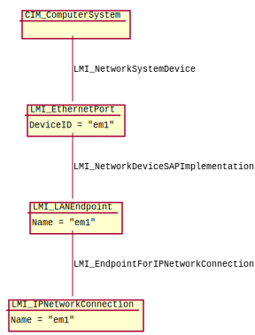
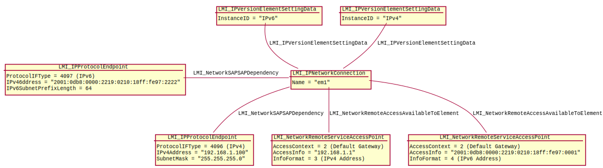
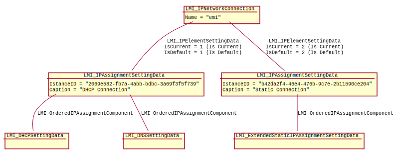

.. _network-concepts:

Networking API concepts
=======================

OpenLMI-Networking provides CIM API. Some CIM knowledge is required and this
guide assumes that reader can routinely read and modify remote CIM objects
and call their intrinsic and extrinsic methods.

Hardware representation
-----------------------

.. _network-hardware:

There is instance of subclass of :ref:`CIM_NetworkPort<CIM-NetworkPort>`
for each physical network device present in the system, e.g.
:ref:`LMI_EthernetPort<LMI-EthernetPort>` for ethernet ports.

Instances of class :ref:`LMI_LANEndpoint <LMI-LANEndpoint>` represent
communication endpoints, identified by MAC address to which the network port
will respond. It's associated to the corresponding instance of
:ref:`CIM_NetworkPort<CIM-NetworkPort>` subclass via instance of
:ref:`LMI_NetworkDeviceSAPImplementation<LMI-NetworkDeviceSAPImplementation>`.

Current network configuration
-----------------------------

:ref:`LMI_IPNetworkConnection<LMI-IPNetworkConnection>` instances
represents the network connection in the system, e.g. "eth0", "p1p1".
Instances of this class are associated to the
:ref:`LMI_LANEndpoint<LMI-LANEndpoint>` via
:ref:`LMI_EndpointForIPNetworkConnection<LMI-EndpointForIPNetworkConnection>`.

.. note::
    There are usually 1:1:1 relation between instances of CIM_NetworkPort
    subclasses, LMI_LANEndpoint instances and LMI_IPNetworkConnection
    instance in this provider. The classes are implemented for sake of
    compatibility with DMTF profiles.

:ref:`LMI_IPProtocolEndpoint<LMI-IPProtocolEndpoint>` - there is instance
of this class for each IP address on any network device and the instance is
associated with :ref:`LMI_IPNetworkConnection<LMI-IPNetworkConnection>` via
:ref:`LMI_NetworkSAPSAPDependency<LMI-NetworkSAPSAPDependency>` and with
:ref:`LMI_LANEndpoint<LMI-LANEndpoint>` via
:ref:`LMI_BindsToLANEndpoint<LMI-BindsToLANEndpoint>`.

Default gateway is represented by instance of
:ref:`LMI_NetworkRemoteServiceAccessPoint <LMI-NetworkRemoteServiceAccessPoint>`
with attribute ``AccessContext`` equal to ``2 (Default Gateway)``.

Instances of class :ref:`LMI_IPVersionSettingData <LMI-IPVersionSettingData>`
represent IPv4 or IPv6 support. If there is instance of this class associated
with :ref:`CIM_ComputerSystem <CIM-ComputerSystem>` it means that the system
supports IPv4 and/or IPv6 (depending on value of the ProtocolIFType property).
Instances of this class can be associated also to
:ref:`LMI_IPNetworkConnection <LMI-IPNetworkConnection>`.
It means that the network connection supports IPv4 and/or IPv6.

Settings
--------

The OpenLMI networking provider is based on concept of ``setting``.
``Setting`` is a set of configuration options that can be applied
to an interface. Each setting is represented by instance of
:ref:`LMI_IPAssignmentSettingData <LMI-IPAssignmentSettingData>`
and it is aggregator for detailed configuration represented by instances
of following classes: :ref:`LMI_DHCPSettingData <LMI-DHCPSettingData>`,
:ref:`LMI_DNSSettingData <LMI-DNSSettingData>`,
:ref:`LMI_ExtendedStaticIPAssignmentSettingData <LMI-ExtendedStaticIPAssignmentSettingData>`.
These detailed settings are associated with the master setting via
:ref:`LMI_OrderedIPAssignmentComponent <LMI-OrderedIPAssignmentComponent>`
where the master has role ``GroupComponent``.

``Settings`` available for given port are associated by
:ref:`LMI_IPElementSettingData <LMI-IPElementSettingData>`.
Its property ``IsCurrent`` is ``1`` when the setting is currently active.
Property ``IsDefault`` is ``1`` when the setting is automatically activated.

Altering and applying settings
------------------------------

Method
:ref:`LMI_CreateIPSetting<LMI-IPNetworkConnectionCapabilities-LMI-CreateIPSetting>`
of the :ref:`LMI_IPNetworkConnectionCapabilites <LMI-IPNetworkConnectionCapabilities>`
class can be used to create new setting. The setting will be tied to
:ref:`LMI_IPNetworkConnection <LMI-IPNetworkConnection>` that is associated
with given
:ref:`LMI_IPNetworkConnectionCapabilites<LMI-IPNetworkConnectionCapabilities>`.

Singleton class :ref:`LMI_IPConfigurationService<LMI-IPConfigurationService>`
provides method
:ref:`ApplySettingToIPNetworkConnection<LMI-IPConfigurationService-ApplySettingToIPNetworkConnection>`
that applies :ref:`LMI_IPAssignmentSettingData<LMI-IPAssignmentSettingData>`
to :ref:`LMI_IPNetworkConnection<LMI-IPNetworkConnection>`.

Bridging and bonding
--------------------

Current state
^^^^^^^^^^^^^

Instance of the :ref:`LMI_LinkAggregator8023ad<LMI-LinkAggregator8023ad>`
class represents currently active bond. It's associated to the
:ref:`LMI_LAGPort8023ad<LMI-LAGPort8023ad>` representing bonded interface via
:ref:`LMI_LinkAggregationBindsTo<LMI-LinkAggregationBindsTo>`.

Instance of the :ref:`LMI_SwitchService<LMI-SwitchService>` class represents
currently active bridge. It's associated to the
:ref:`LMI_SwitchPort<LMI-SwitchPort>` representing bridged interface via
:ref:`LMI_SwitchesAmong<LMI-SwitchesAmong>`".

Creating bridge/bond
^^^^^^^^^^^^^^^^^^^^

Creating bridge/bond setting is the same as creating any other setting, just
the ``Type`` parameter of the
:ref:`LMI_CreateIPSetting<LMI-IPNetworkConnectionCapabilities-LMI-CreateIPSetting>`
is different (``Bonding`` or ``Bridging``).

Bonding/bridging setting details can be altered by changing the properties of
:ref:`LMI_BondingMasterSettingData<LMI-BondingMasterSettingData>` (or
:ref:`LMI_BridgingMasterSettingData<LMI-BridgingMasterSettingData>`) instance
that is returned from the
:ref:`LMI_CreateIPSetting<LMI-IPNetworkConnectionCapabilities-LMI-CreateIPSetting>`
method.

For activating bridge/bond setting, use
:ref:`ApplySettingToIPNetworkConnection<LMI-IPConfigurationService-ApplySettingToIPNetworkConnection>`
of the :ref:`LMI_IPConfigurationService<LMI-IPConfigurationService>` class.

For deletion of the bridge/bond setting just delete the "master" setting
(the one created by
:ref:`LMI_CreateIPSetting<LMI-IPNetworkConnectionCapabilities-LMI-CreateIPSetting>`).
Deleting other settings will just remove the slave from the settings.

Enslaving
^^^^^^^^^

First network interface is enslaved to the given bond/bridge setting
automatically (depending on what
:ref:`LMI_IPNetworkConnectionCapabilities<LMI-IPNetworkConnectionCapabilities>`
is the
:ref:`LMI_CreateIPSetting<LMI-IPNetworkConnectionCapabilities-LMI-CreateIPSetting>`
method called). Other interface can be enslaved by using
:ref:`LMI_CreateSlaveSetting<LMI-IPNetworkConnectionCapabilities-LMI-CreateSlaveSetting>`
method of the :ref:`LMI_IPNetworkConnectionCapabilities<LMI-IPNetworkConnectionCapabilities>`.

Alter the :ref:`LMI_BondingSlaveSettingData<LMI-BondingSlaveSettingData>` (or
:ref:`LMI_BridgingSlaveSettingData<LMI-BridgingSlaveSettingData>`) instance to
change the properties of bond/bridge slave.
