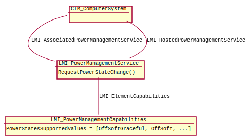

.. _power-usage:

Usage
=====

   Class diagram for Power Management provider.

Base class of this provider is
:ref:`LMI_PowerManagementService <LMI-PowerManagementService>`.
This class has method
:ref:`RequestPowerStateChange <LMI-PowerManagementService-RequestPowerStateChange>`
that can be used for changing between power states.

For list of available power states, see property
:ref:`PowerStatesSupported <LMI-PowerManagementCapabilities-PowerStatesSupported>`
of the class
:ref:`LMI_PowerManagementCapabilities <LMI-PowerManagementCapabilities>`

All example scripts are for ``lmishell``. See it's documentation_ on OpenLMI_
page.

.. _documentation: https://fedorahosted.org/openlmi/wiki/shell
.. _OpenLMI: https://fedorahosted.org/openlmi/

We also assume that ``lmishell`` is connected to the CIMOM and the
connection is stored in ``connection`` variable::

    connection = connect("server", "username", "password")
    ns = connection.root.cimv2

Enumeration of available power states
-------------------------------------

To see the available power states on given managed system, use following::

    capabilities = ns.LMI_PowerManagementCapabilities.first_instance()
    for state in capabilities.PowerStatesSupported:
        print ns.LMI_PowerManagementCapabilities.PowerStatesSupportedValues.value_name(state)

Setting the power state
-----------------------

Let's say we want to power off the system gracefully::

    # Check if the power state is available first
    capabilities = ns.LMI_PowerManagementCapabilities.first_instance()
    if not ns.LMI_PowerManagementCapabilities.PowerStatesSupportedValues.OffSoftGraceful in capabilities.PowerStatesSupported:
        print "OffSoftGraceful state is not supported"
        return
    # Get the PowerManagement service
    service = ns.LMI_PowerManagementService.first_instance()
    # Invoke the state change
    service.RequestPowerStateChange(PowerState=ns.LMI_PowerManagementCapabilities.PowerStatesSupportedValues.OffSoftGraceful)

Note that the job returned from this function is not much usable because
when system is shutting down, the CIMOM is terminated as well.
