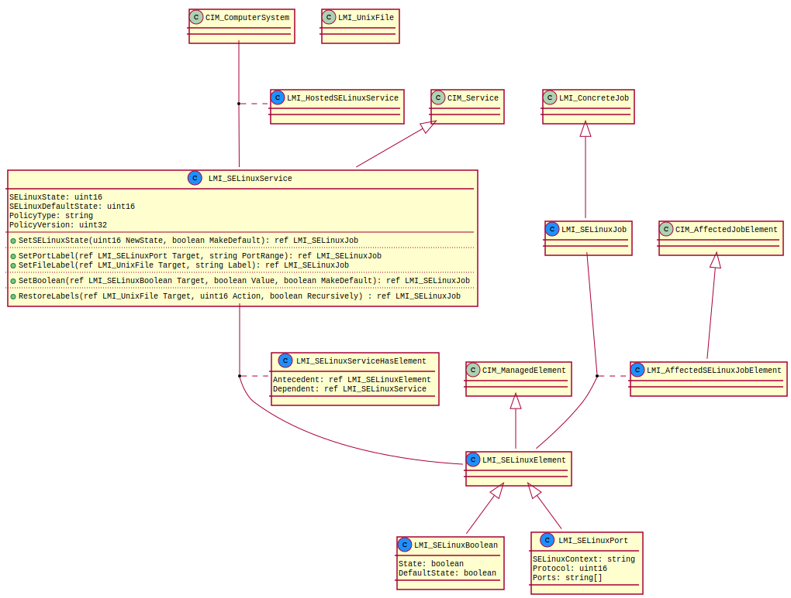

Introduction
============

SELinux provider model is displayed in the following figure. Classes with the
blue mark are part of the provider.

   SELinux provider model

Basic SELinux entities are represented by :ref:`LMI_SELinuxElement
<LMI-SELinuxElement>`. It is a basic class from which concrete SELinux items are
derived. All SELinux elements use their `InstanceID` as a primary
identifier. Concrete cases are describe below.

:ref:`LMI_SELinuxBoolean <LMI-SELinuxBoolean>` represents an SELinux boolean on a
system. Concrete boolean instances are uniquely identified by their `InstanceID`
in the form of `LMI:LMI_SELinuxBoolean:<boolean name>`.

:ref:`LMI_SELinuxPort <LMI-SELinuxPort>` is a class encompassing multiple
individual network ports, or even their ranges. Its `InstanceID` is in the form of `LMI:LMI_SELinuxPort:<type>:<port name>`. Port type can be either `TCP` or `UDP`.

To read SELinux file labels, the :ref:`LMI_UnixFile <LMI-UnixFile>` has to be
used. This class is part of the `LogicalFile
<http://www.openlmi.org/sites/default/files/doc/admin/openlmi-providers/latest/logicalfile/index.html>`_
provider.

:ref:`LMI_SELinuxService <LMI-SELinuxService>` is the main class that allows
users to modify SELinux state on the system. The class also provides some basic
information about SELinux. It is connected to the computer system on which the
provider resides by :ref:`LMI_HostedSELinuxService
<LMI-HostedSELinuxService>`. All instances of :ref:`LMI_SELinuxElement
<LMI-SELinuxElement>` are associated with the service via
:ref:`LMI_SELinuxServiceHasElement <LMI-SELinuxServiceHasElement>`.

Every method that is provided by :ref:`LMI_SELinuxService <LMI-SELinuxService>`
returns an :ref:`LMI_SELinuxJob <LMI-SELinuxJob>` instance, because the actions
that are executed by those methods are expected to take a long time. Which of
the concrete :ref:`LMI_SELinuxElement <LMI-SELinuxElement>` instances are
operated on by a job instance is determined by :ref:`LMI_AffectedSELinuxJobElement
<LMI-AffectedSELinuxJobElement>`.
