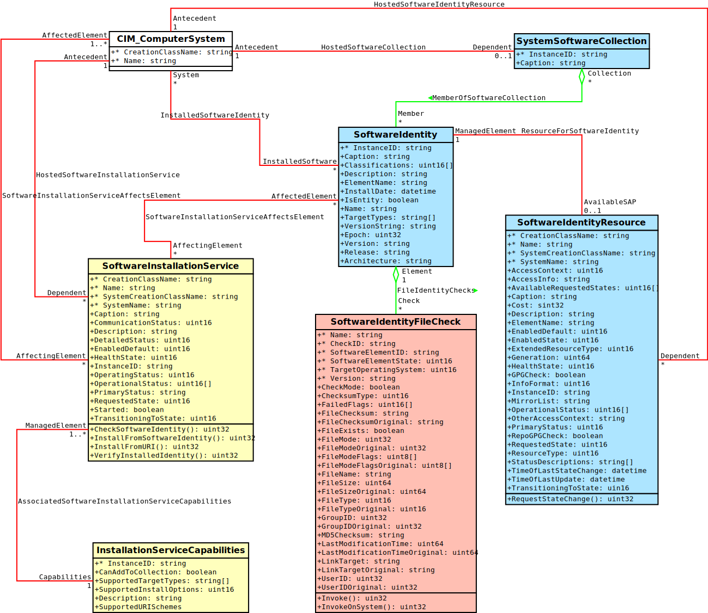

.. _software-api-concept:

Software API Concept
====================

Package database, repositories and the package manager itself are modeled with
*CIM* classes according to several :ref:`DMTF profiles
<software_dmtf_profiles>` . Querying a database, installing, updating or
removing some package executes some operation on one or more *CIM* classes.
Let's talk about their relation to managed elements.

    Class model for software management provided by OpenLMI-Software
    provider.

Classes with the blue background belong to :ref:`software_inventory_profile`.
Classes painted yellow belong to :ref:`software_update_profile` that builds on
the former one. Classes painted red/pink are OpenLMI-specific extensions.

Instance and Instance Names
---------------------------

Each *CIM* class can have several instances. Each instance is uniquely
identified by one or several key properties. All properties are defined by
corresponding class. For example :ref:`LMI_SoftwareIdentity
<LMI-SoftwareIdentity>` has one key property ``InstanceID`` that uniquely
identifies particular software package. An *instance* have many other
properties - all defined by corresponding class. An *instance name* is a
minimal set of information identifying particular *instance*. Its string form
typically looks like::

    [<host>/]<namespace>:<classname>.<keybindings>

For example::

    root/cimv2:LMI_SoftwareIdentity.InstanceID="LMI:LMI_SoftwareIdentity:kernel-0:3.17.0-0.rc7.git3.1.fc22.x86_64"

Most methods of OpenLMI-Software provider operate on *instance names* and they
return them as well. They can easily be turned into instances with
``GetInstance()`` operation. In *LMIShell* it is achieved like this::

    instance = instance_name.to_instance()

Mapping objects to *CIM* classes
--------------------------------

====================================================  =====================================
Element                                               *CIM* class
----------------------------------------------------  -------------------------------------
:ref:`Package <representing-package>`                 :ref:`LMI_SoftwareIdentity <LMI-SoftwareIdentity>`
:ref:`Repository <representing-repository>`           :ref:`LMI_SoftwareIdentityResource <LMI-SoftwareIdentityResource>`
:ref:`Installed file <representing-installed-file>`   :ref:`LMI_SoftwareIdentityFileCheck <LMI-SoftwareIdentityFileCheck>`
Package manager                                       :ref:`LMI_SoftwareInstallationService <LMI-SoftwareInstallationService>`
====================================================  =====================================

.. _representing-package:

Representing Package
--------------------
Software package is represented by :ref:`LMI_SoftwareIdentity
<LMI-SoftwareIdentity>`. It has single key property :ref:`InstanceID
<LMI-SoftwareIdentity-InstanceID>`. It is composed of *ORGID* prefix, class
name and package information::

    LMI:LMI_SoftwareIdentity:<package-id>

``<package-id>`` is a *NEVRA* string as used by `RPM`_ tool. It stands for
*Name*, *Epoch*, *Version*, *Release* and *Architecture*. These are composed
in specific way::

    <name>-<epoch>:<version>-<release>.<architecture>

This is similar to what ``rpm`` tool returns when listing installed packages::

        $ rpm -qa 'openlmi-*' vim-enhanced
        openlmi-python-base-0.3.0_5_gf056906-2.fc21.noarch
        openlmi-providers-0.3.0_5_gf056906-2.fc21.x86_64
        vim-enhanced-7.4.027-2.fc20.x86_64
        openlmi-logicalfile-0.3.0_5_gf056906-2.fc21.x86_64
        openlmi-python-providers-0.3.0_5_gf056906-2.fc21.noarch
        openlmi-software-0.3.0_5_gf056906-2.fc21.noarch

There is just one difference -- ``rpm`` usually omits ``<epoch>:`` part. To get
an :ref:`InstanceID <LMI-SoftwareIdentity-InstanceID>` of installed packages out of
this tool, you need to specify format::

        $ rpm --qf 'LMI:LMI_SoftwareIdentity:%{NAME}-%{EPOCH}:%{VERSION}-%{RELEASE}.%{ARCH}\n' -qa 'openlmi-*' | sed 's/(none)/0/'
        LMI:LMI_SoftwareIdentity:openlmi-python-base-0:0.3.0_5_gf056906-2.fc21.noarch
        LMI:LMI_SoftwareIdentity:openlmi-providers-0:0.3.0_5_gf056906-2.fc21.x86_64
        LMI:LMI_SoftwareIdentity:vim-enhanced-2:7.4.027-2.fc20.x86_64
        LMI:LMI_SoftwareIdentity:openlmi-logicalfile-0:0.3.0_5_gf056906-2.fc21.x86_64
        LMI:LMI_SoftwareIdentity:openlmi-python-providers-0:0.3.0_5_gf056906-2.fc21.noarch
        LMI:LMI_SoftwareIdentity:openlmi-software-0:0.3.0_5_gf056906-2.fc21.noarch

Some *RPM* packages do not define *Epoch* part, which means it's 0. ``rpm``
returns ``(none)`` though. Therefore we need to substitute it with 0. Although
C implementation of software provider uses `PackageKit`_ supporting many
non-RPM backends that don't have any notion about epoch, the epoch part stays
(set to zero).

When installing, updating or removing package, we operate upon an instance or
object path of this class.

.. seealso::
    :ref:`identifying_software_identity`

.. _representing-repository:

Representing Repository
-----------------------

Package repository is represented by :ref:`LMI_SoftwareIdentityResource
<LMI-SoftwareIdentityResource>`.

All its key properties are:

 * :ref:`CreationClassName <LMI-SoftwareIdentityResource-CreationClassName>`
 * :ref:`Name <LMI-SoftwareIdentityResource-Name>`
 * :ref:`SystemCreationClassName <LMI-SoftwareIdentityResource-SystemCreationClassName>`
 * :ref:`SystemName <LMI-SoftwareIdentityResource-SystemName>`

Only ``Name`` differs on particular system. Others are the same e.g. (using
`MOF syntax`_) ::

    instance of LMI_SoftwareIdentityResource {
        CreationClassName = 'LMI_SoftwareIdentityResource';
        Name = 'rawhide';
        SystemCreationClassName = 'PG_ComputerSystem';
        SystemName = 'myhost.example.org';
        /* other non-key properties omitted */
    };

    instance of LMI_SoftwareIdentityResource {
        CreationClassName = 'LMI_SoftwareIdentityResource';
        Name = 'rawhide-source';
        SystemCreationClassName = 'PG_ComputerSystem';
        SystemName = 'myhost.example.org';
        /* other non-key properties omitted */
    };

On systems using `yum`_ the :ref:`Name <LMI-SoftwareIdentityResource-Name>` is
repository's name written in square brackets in its configuration
file::

    $ cat /etc/yum.repos.d/fedora-rawhide.repo
    [rawhide]
    name=Fedora - Rawhide - Developmental packages for the next Fedora release
    failovermethod=priority
    metalink=https://mirrors.fedoraproject.org/metalink?repo=rawhide&arch=$basearch
    enabled=1
    metadata_expire=12h

.. _representing-installed-file:

Representing installed file
---------------------------

.. warning::

    This feature is available only on `RPM`_ based distributions.

Installed file is represented by
:ref:`LMI_SoftwareIdentityFileCheck<LMI-SoftwareIdentityFileCheck>`. Its
another meaning is a result of package's verification for its particular file.
It contains attributes being verified such as

 * ``User ID``
 * ``Group ID``
 * ``Checksum``
 * ``Link Target``
 * ``File Mode``

Each is present twice. First property represents the current value of installed
file and the other the value stored in *RPM* package that the file should
have. Second property have ``Original`` suffix. So for example:

 * :ref:`UserID<LMI-SoftwareIdentityFileCheck-UserID>` vs
   :ref:`UserIDOriginal<LMI-SoftwareIdentityFileCheck-UserIDOriginal>`
 * :ref:`FileChecksum<LMI-SoftwareIdentityFileCheck-FileChecksum>` vs
   :ref:`FileChecksumOriginal<LMI-SoftwareIdentityFileCheck-FileChecksumOriginal>`

Mentioned attributes are compared when the package verification is done. Single
file can also be easily checked. Either by running
:ref:`LMI_SoftwareIdentityFileCheck.Invoke()<LMI-SoftwareIdentityFileCheck-Invoke>`
method on particular object path or by testing the
:ref:`FailedFlags<LMI-SoftwareIdentityFileCheck-FailedFlags>` property for
emptiness. If its empty, the file or directory passed the verification test.

Asynchronous jobs
-----------------

Most of Software manipulation methods, for example
:ref:`InstallFromSoftwareIdentity()
<LMI-SoftwareInstallationService-InstallFromSoftwareIdentity>`, can be
time-consuming. Therefore the methods only check input parameters and return
immediately with a reference to :ref:`LMI_SoftwareJob <LMI-SoftwareJob>`
instance. The operation itself is performed asynchronously on the server in a
separate thread or process.

The returned :ref:`LMI_SoftwareJob <LMI-SoftwareJob>` instance can be then used to
either pull the operation status or applications can subscribe for job events
and get an indication when a job status changes.

Currently, only one job is being executed at a time, all others are enqueued and
executed later.

Job status
^^^^^^^^^^

The job status is exposed in :ref:`OperationalStatus
<CIM-ManagedSystemElement-OperationalStatus>` and :ref:`JobState
<CIM-ConcreteJob-JobState>` properties. Their combination compose unique job
status:

============== ===================== ===============
Job is         ``OperationalStatus`` ``JobState``
-------------- --------------------- ---------------
Queued         Dormant               New
Suspended [*]_ OK                    Suspended
Running        OK                    Running
Finished OK    Completed, OK         Completed
Failed         Completed, Error      Exception
Cancelled      Stopped               Terminated
============== ===================== ===============

.. [*] Software job cannot be suspended as of now.

:ref:`Job.RequestStateChange <CIM-ConcreteJob-RequestStateChange>` method can be
used to cancel a job. Only Queued or Running job can be cancelled. Cancellation
of a running job succeeds rarely though.

   Job state machine.

By default, all job instances disappear automatically 5 minutes after they
reach any final state. This can be overridden by setting
:ref:`TimeBeforeRemoval <CIM-ConcreteJob-TimeBeforeRemoval>` and
:ref:`DeleteOnCompletion <CIM-Job-DeleteOnCompletion>` properties of a job.

Software job types
^^^^^^^^^^^^^^^^^^
There are two descendants of :ref:`LMI_SoftwareJob <LMI-SoftwareJob>` used in different
contexts:

    :ref:`LMI_SoftwareInstallationJob <LMI-SoftwareInstallationJob>`
        Is an output parameter of:

        * :ref:`InstallFromSoftwareIdentity() <LMI-SoftwareInstallationService-InstallFromSoftwareIdentity>`
        * :ref:`InstallFromURI() <LMI-SoftwareInstallationService-InstallFromURI>`

        Its :ref:`InstanceID <LMI-SoftwareJob-InstanceID>` looks like::

            LMI:LMI_SoftwareInstallationJob:<jobnumber>

    :ref:`LMI_SoftwareVerificationJob <LMI-SoftwareVerificationJob>`
        Is an output parameter of :ref:`VerifyInstalledIdentity()
        <LMI-SoftwareInstallationService-InstallFromURI>`.

        Its :ref:`InstanceID <LMI-SoftwareJob-InstanceID>` looks like::

            LMI:LMI_SoftwareVerificationJob:<jobnumber>

``<jobnumber>`` is an integer being incremented with each new instance of
:ref:`LMI_SoftwareJob <LMI-SoftwareJob>`. Thus Installation and verification
jobs won't ever have the same number.

Return value and output parameters
^^^^^^^^^^^^^^^^^^^^^^^^^^^^^^^^^^

Return value and output parameters of an asynchronous method call are stored in
:ref:`LMI_SoftwareJob.JobOutParameters <CIM-ConcreteJob-JobOutParameters>`
property, which is EmbeddedObject of a class, which has property for each output
parameter of the asynchronous method. The method return value itself is
available there too, as ``__ReturnValue`` property.

The output parameters are also included in
:ref:`LMI_SoftwareMethodResult.PostCallIndication
<CIM-MethodResult-PostCallIndication>` property. *Method Result* is associated
to the job via :ref:`LMI_AssociatedSoftwareJobMethodResult
<LMI-AssociatedSoftwareJobMethodResult>`. The property itself is embedded
instance of :ref:`CIM_InstMethodCall<CIM-InstMethodCall>` class. Return value
is stored in its :ref:`ReturnValue <CIM-InstMethodCall-ReturnValue>` property.
Output parameters are stored in its :ref:`MethodParameters
<CIM-InstMethodCall-MethodParameters>` property.

Due to broker's limitations it's not yet possible to include array of
references among output parameters. Therefore several most important output
parameters can be obtained only via
:ref:`LMI_AffectedSoftwareJobElement<LMI-AffectedSoftwareJobElement>`
association.

   Instance diagram of a job before finishing.

   Instance diagram of a job after finishing.

Use this association on successfully completed job to:

* List installed or removed packages associated to :ref:`LMI_SoftwareInstallationJob
  <LMI-SoftwareInstallationJob>` triggered with a call to
  :ref:`InstallFromSoftwareIdentity()
  <LMI-SoftwareInstallationService-InstallFromSoftwareIdentity>`.
  See :ref:`example-install-package-async`.
* List files that did not pass verification test associated to
  :ref:`LMI_SoftwareVerificationJob <LMI-SoftwareVerificationJob>` triggered
  with a call to :ref:`VerifyInstalledIdentity()
  <LMI-SoftwareInstallationService-VerifyInstalledIdentity>`. See
  :ref:`example-verify-package`.

.. ****************************************************************************

.. _RPM: http://www.rpm.org/
.. _PackageKit: http://www.freedesktop.org/software/PackageKit/
.. _yum: http://yum.baseurl.org/
.. _`MOF syntax`: http://www.wbemsolutions.com/tutorials/CIM/cim-mof-bnf.html
