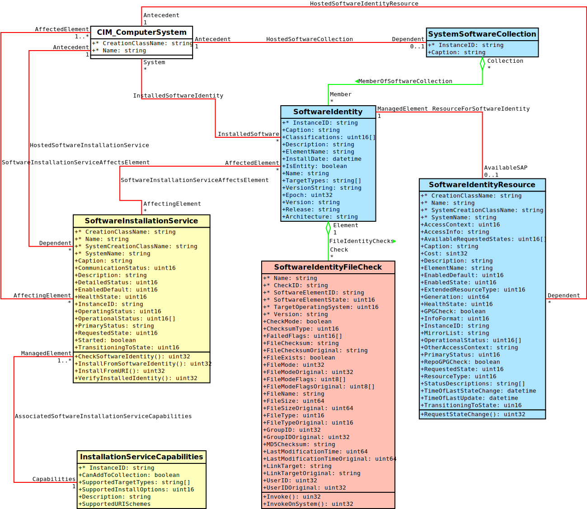

.. _software_introduction:

Introduction
============
*OpenLMI Software* provider allows to query and manipulate software package
database on remote hosts. They utilize :abbr:`YUM (Yellowdog Updater
Modified)` which is a standard package manager for several *GNU/Linux*
distributions. They provide the subset of its functionality.

*RPM* database, repositories and the package manager itself are modeled with
*CIM* classes according to several *DMTF* profiles described
:ref:`later<software_dmtf_profiles>`. To make a query on database, install, update a
remove some *RPM* package means to trigger some operation on one or several
*CIM* classes. This page explains the mapping of mentioned objects to
corresponding classes.

    This model shows classes representing various objects taking role in
    software management provided by *OpenLMI Software* provider.

Classes with the blue background belong to :ref:`software_inventory_profile`.
Classes painted yellow belong to :ref:`software_update_profile` that builds on
the former one. Classes painted red/pink are extensions not beloning to any
*DMTF* profile.

Mapping of objects to *CIM* classes
-----------------------------------
*RPM* package : :ref:`LMI_SoftwareIdentity<LMI-SoftwareIdentity>`
    Is represented by ``LMI_SoftwareIdentity``. It's identified by a single
    key property called
    :ref:`LMI_SoftwareIdentity.InstanceID<LMI-SoftwareIdentity-InstanceID>`.
    This is a composition of some *CIM* related prefix with package's *NEVRA*
    string. It's the similar string you may see, when listing package with
    ``rpm`` tool: ::

        $ rpm -qa 'openlmi-*' vim-enhanced
        openlmi-python-base-0.3.0_5_gf056906-2.fc21.noarch
        openlmi-providers-0.3.0_5_gf056906-2.fc21.x86_64
        openlmi-indicationmanager-libs-0.3.0_5_gf056906-2.fc21.x86_64
        openlmi-account-0.3.0_5_gf056906-2.fc21.x86_64
        openlmi-service-0.3.0_5_gf056906-2.fc21.x86_64
        vim-enhanced-7.4.027-2.fc20.x86_64
        openlmi-logicalfile-0.3.0_5_gf056906-2.fc21.x86_64
        openlmi-storage-0.6.0-2.fc20.noarch
        openlmi-python-providers-0.3.0_5_gf056906-2.fc21.noarch
        openlmi-providers-debuginfo-0.3.0_5_gf056906-2.fc21.x86_64
        openlmi-software-0.3.0_5_gf056906-2.fc21.noarch

    except for *Epoch* part, which is omitted by ``rpm`` tool but is
    required to be present in ``InstanceID`` by instrumenting provider.
    To get the expected output, the above command needs to be modified: ::

        $ rpm --qf '%{NAME}-%{EPOCH}:%{VERSION}-%{RELEASE}.%{ARCH}\n' -qa 'openlmi-*' | sed 's/(none)/0/'
        openlmi-python-base-0:0.3.0_5_gf056906-2.fc21.noarch
        openlmi-providers-0:0.3.0_5_gf056906-2.fc21.x86_64
        openlmi-indicationmanager-libs-0:0.3.0_5_gf056906-2.fc21.x86_64
        openlmi-account-0:0.3.0_5_gf056906-2.fc21.x86_64
        openlmi-service-0:0.3.0_5_gf056906-2.fc21.x86_64
        vim-enhanced-2:7.4.027-2.fc20.x86_64
        openlmi-logicalfile-0:0.3.0_5_gf056906-2.fc21.x86_64
        openlmi-storage-0:0.6.0-2.fc20.noarch
        openlmi-python-providers-0:0.3.0_5_gf056906-2.fc21.noarch
        openlmi-providers-debuginfo-0:0.3.0_5_gf056906-2.fc21.x86_64
        openlmi-software-0:0.3.0_5_gf056906-2.fc21.noarch

    Some *RPM* packages do not define *Epoch* part, which means its 0 although
    ``rpm`` returns ``(none)``.

    When installing, updating or removing package, we operate upon an
    instance or object path of this class.

    .. seealso::
        :ref:`identifying_software_identity`

Repository : :ref:`LMI_SoftwareIdentityResource<LMI-SoftwareIdentityResource>`
    Is represented by ``LMI_SoftwareIdentityResource``. What distinguishes
    particular repository from others on the same system is a
    :ref:`LMI_SoftwareIdentityResource.Name<LMI-SoftwareIdentityResource-Name>`
    key property. It's the name of repository written in square brackets in
    repository config. Not the configuration file name, not the ``name``
    option, but a the name of section. See the example of ``OpenLMI Nightly``
    repository: ::

        $ cat /etc/yum.repos.d/openlmi-nightly.repo
        [openlmi-nightly]
        name=OpenLMI Nightly
        baseurl=http://openlmi-rnovacek.rhcloud.com/rpm/rawhide/
        gpgcheck=0
        enabled = 1

    The ``Name`` property of corresponding  *Software Identity Resource* will
    be ``openlmi-nightly``.

Installed file : :ref:`LMI_SoftwareIdentityFileCheck<LMI-SoftwareIdentityFileCheck>`
    Is represented by ``LMI_SoftwareIdentityFileCheck``. Represents a
    verification check of particular file installed by *RPM* package. It contains
    attributes being checked, like:

        * ``User ID``, ``Group ID``
        * ``Checksum``
        * ``Link Target``
        * ``File Mode`` and others

    Each is present twice. One property represents the current value of
    installed file and the other the value stored in *RPM* package, that the
    file should have. The later properties have ``Original`` suffix. So for
    example:

        * :ref:`UserID<LMI-SoftwareIdentityFileCheck-UserID>` vs
          :ref:`UserIDOriginal<LMI-SoftwareIdentityFileCheck-UserIDOriginal>`
        * :ref:`FileChecksum<LMI-SoftwareIdentityFileCheck-FileChecksum>` vs
          :ref:`FileChecksumOriginal<LMI-SoftwareIdentityFileCheck-FileChecksumOriginal>`

    Mentioned attributes are compared when the package verification is done.
    Single file can also be easily checked. Either by running
    :ref:`LMI_SoftwareIdentityFileCheck.Invoke()<LMI-SoftwareIdentityFileCheck-Invoke>`
    method on particular object path or by testing the
    :ref:`FailedFlags<LMI-SoftwareIdentityFileCheck-FailedFlags>` property for
    emptiness. If its empty, the file or directory passed the verification test.

*RPM* database : :ref:`LMI_SystemSoftwareCollection<LMI-SystemSoftwareCollection>`
    Is represented by ``LMI_SystemSoftwareCollection``. Administrator probably
    won't be interested in this class. The
    :ref:`LMI_MemberOfSoftwareCollection<LMI-MemberOfSoftwareCollection>`
    association class associates this collection with available and installed
    *Software Identities*. It can not be enumerated --- due to the same reason
    as in case of :ref:`LMI_SoftwareIdentity<LMI-SoftwareIdentity>` (see the
    explanation in :ref:`package_searching`).

*YUM* package manager : :ref:`LMI_SoftwareInstallationService<LMI-SoftwareInstallationService>`
    Is represented by ``LMI_SoftwareInstallationService``. Allows to query the
    database, install, update, verify and remove *RPM* packages. All of this can
    be achieved by invocations of its methods:

        :ref:`FindIdentity()<LMI-SoftwareInstallationService-FindIdentity>`
            Allows to query the database for matching packages.

        :ref:`InstallFromSoftwareIdentity()<LMI-SoftwareInstallationService-InstallFromSoftwareIdentity>`
            Allows to install, update or remove *RPM* package represented by an
            instance of *Software Identity*.

        :ref:`InstallFromURI()<LMI-SoftwareInstallationService-InstallFromURI>`
            Allows to install or update *RPM* package located with particular
            URI string.

        :ref:`VerifyInstalledIdentity()<LMI-SoftwareInstallationService-VerifyInstalledIdentity>`.
            Runs a verification check on given *Software Identity*.

    .. seealso::
        Examples on using above methods:

            * :ref:`package_installation`
            * :ref:`package_update`
            * :ref:`package_removal`
            * :ref:`package_verification`
