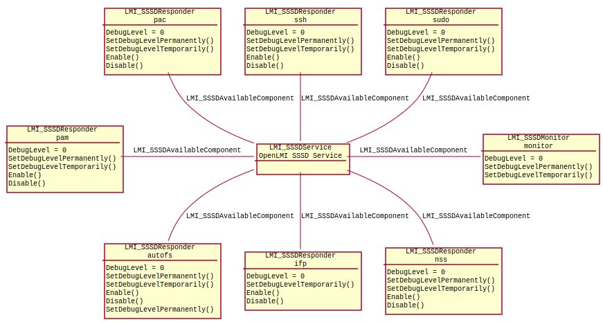
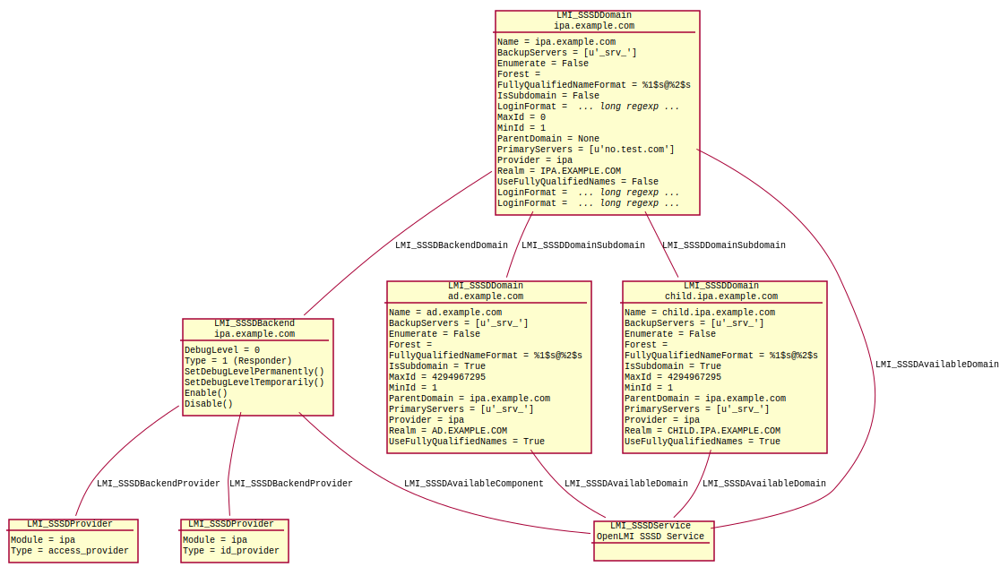

Introduction
============

SSSD provider does not follow any DMTF profile.

The base class of any SSSD management is
:ref:`LMI_SSSDService <LMI-SSSDService>`. While it does not provide any
functionality by itself, configuration of all SSSD component is associated to
it.

First, let's look at the simple classes:

   SSSD provider model - basics

* Instance of :ref:`LMI_SSSDMonitor <LMI-SSSDMonitor>` is a SSSD component that
  executes the other components and makes sure they stay running.

* Instances of :ref:`LMI_SSSDResponder <LMI-SSSDResponder>` class represent
  SSSD components that implement one of the supported services and provide
  data to clients.

SSSD provider shows also domains and subdomains:

   SSSD provider model - domains

* :ref:`LMI_SSSDDomain <LMI-SSSDDomain>` represents joined domains and
  subdomains. In this example, ``IPA.EXAMPLE.COM`` is the main domain, with two
  subdomains, ``AD.EXAMPLE.COM`` and ``CHILD.IPA.EXAMPLE.COM``.

* :ref:`LMI_SSSDBackend <LMI-SSSDBackend>` represents SSSD backends - components
  that manage data from one domain and its subdomains. Each domain has exactly
  one backend, which can be enabled or disabled in order to enable or disable
  the domain.

* :ref:`LMI_SSSDProvider <LMI-SSSDProvider>` represents data providers for SSSD.
  Note: these are **not** CIM providers.
