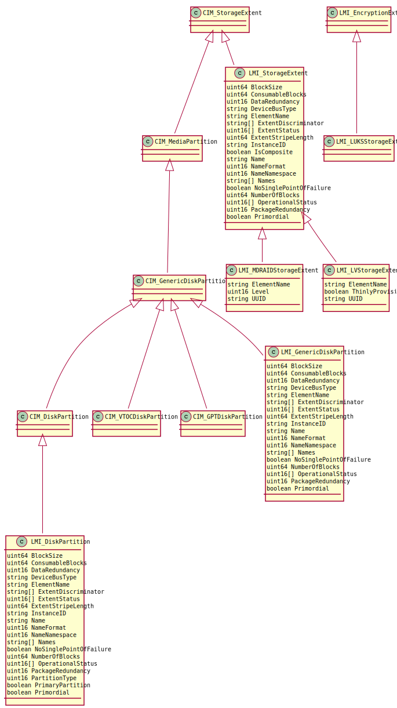
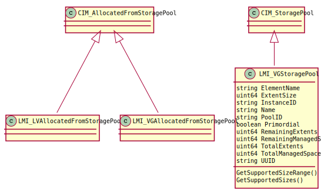
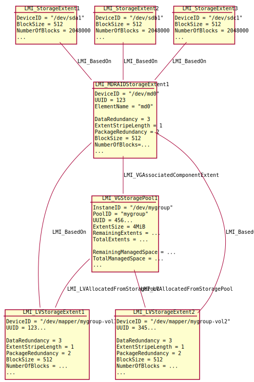

Device hierarchy
================

The API manages all block devices in machine's local /dev/ directory, i.e. also
remote disks (iSCSI, FcoE, ...), as long as there is appropriate device in
local /dev/.

The API exposed by OpenLMI-Storage is object-oriented. Each block device present
on the managed system is represented as instance of
:ref:`CIM_StorageExtent<CIM-StorageExtent>` class. The instance has properties
like DeviceID, Name, BlockSize and NumberOfBlocks, which describe the block
device.

:ref:`CIM_StorageExtent<CIM-StorageExtent>` has several subclasses, such as
:ref:`LMI_DiskPartition<LMI-DiskPartition>` (=MS DOS partition) or
:ref:`LMI_LVStorageExtent<LMI-LVStorageExtent>` (=Logical Volume), which add
properites specific for the particular device type.

Each block device is represented by instance of
:ref:`CIM_StorageExtent<CIM-StorageExtent>` or its subclasss.

:ref:`LMI_StorageExtent<LMI-storageextent>` represents all devices, which do not
have any specific :ref:`CIM_StorageExtent<CIM-StorageExtent>` subclass.

Each volume group is represented by :ref:`LMI_VGStoragePool<LMI-VGStoragePool>`.

Instances of :ref:`LMI_VGStoragePool<LMI-VGStoragePool>`,
:ref:`CIM_StorageExtent<CIM-StorageExtent>` and its subclasses
compose an oriented graph of devices on the system. Devices are connected with
these associations or their subclasses:

- :ref:`CIM_BasedOn<CIM-BasedOn>` and is subclasses associates a block device to
  all devices, on which it directly depends on, for example a partition is
  associated to a disk, on which it resides, and MD RAID is associated to all
  underlying devices, which compose the RAID.

- :ref:`LMI_VGAssociatedComponentExtent<LMI-VGAssociatedComponentExtent>`
  associates volume groups with its physical extents.

- :ref:`LMI_LVAllocatedFromStoragePool<LMI-LVAllocatedFromStoragePool>`
  associates logical volumes to their volume groups.

   Example of two logical volumes allocated from volume group created on top of
   MD RAID with three devices.

All other storage objects, like partition tables, filesystems and mounts are
designed in similar way - all these are instances of particular classes.

These storage elements are managed (i.e. created / modified and deleted) by
subclasses of :ref:`CIM_Service<CIM-Service>` such as
:ref:`LMI_FileSystemConfigurationService<LMI-FileSystemConfigurationService>`.
These services are not system services in systemd or UNIX SysV sense, it is just
API collecting bunch of methods related to a particular topic, e.g. filesystem
management in our example.

These services are described in :doc:`OpenLMI-Storage API<usage>` chapter.
