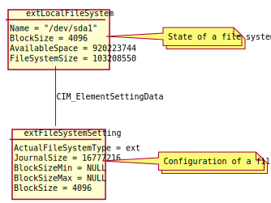
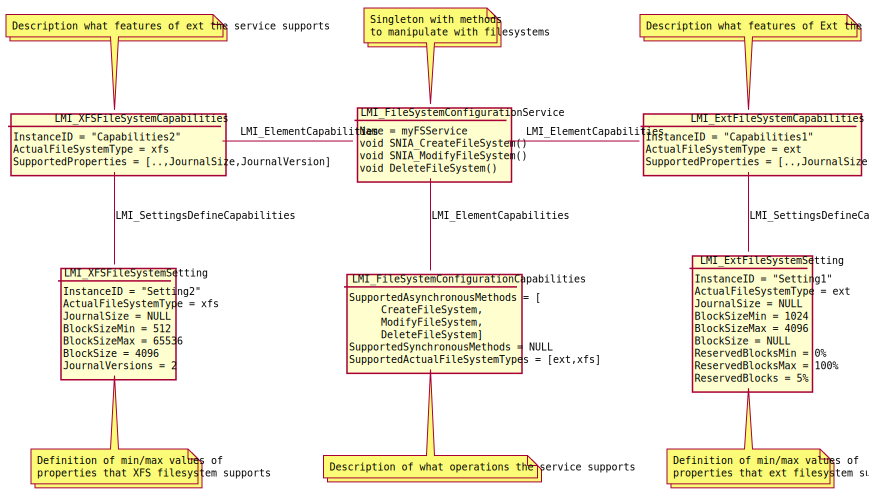

CIM API concepts
================

Storage API is based on several design patterns, which are common in CIM and
SMI-S.

Separation of state and configuration
-------------------------------------
If *foo* is configurable, CIM uses two classes to describe it:

- ``CIM_Foo``: *state* of foo.

- ``CIM_FooSetting``: *configuration* of foo.

That means, each *foo* on managed system is represented by one ``CIM_Foo``
instance and one ``CIM_FooSetting`` instance. They are connected together using
``CIM_FooElementSettingData`` association instance.

If there is no ``CIM_FooSetting instance`` for a ``CIM_Foo``, it indicates that
the *foo* is not configurable.

For example, a local filesystem is represented by:

- one instance of ``CIM_LocalFileSystem``, which contains *state* of the
  filesystem – nr. of inodes, nr. of free inodes, total space on the
  filesystem, free space, etc.

- one instance of ``CIM_LocalFileSystemSetting``, which contains
  *configuration* of the filesystem – inode size, journal size, ...

Sometimes, state and configuration overlap. In our filesystem example,
``BlockSize`` is property of both ``CIM_LocalFileSystem`` and
``CIM_LocalFileSystemSetting``. Logically, the ``BlockSize`` should be only in
``CIM_LocalFileSystemSetting``. But if a filesystem was not configurable, there
would be no ``CIM_LocalFileSystemSetting`` for it and therefore any management
application would not have access to its ``BlockSize``, which is important
feature of the filesystem.

Configuration service
---------------------
In CIM world, managed elements cannot be configured directly by editing the
associated ``CIM_FooSetting`` with the configuration of *foo*. Instead, there
is ``CIM_FooConfigurationService`` singleton, which has method to create,
modify and sometimes also delete *foos*.

Change of configuration
-----------------------
If an application want to change configuration of a *foo*, it must create new
auxiliary ``CIM_FooSetting`` instance with requested new configuration and
associate this new ``CIM_FooSetting`` with the ``CIM_Foo`` it wants to
configure. The application does not need to completely fill the auxiliary
``CIM_FooSetting``, in most cases it is enough to edit only the properties that
it wants to change, the rest of properties can be ``NULL``.

For example, to change ``CIM_LocalFileSystemSetting`` of a
``CIM_LocalFileSystem``, the application must create new
``CIM_LocalFileSystemSetting``, fill its properties it wants to change and then
call ``CIM_FileSystemConfigurationService.SNIA_ModifyFileSystem()`` method.

The auxiliary ``CIM_LocalFileSystemSetting`` created by the application can be
reused by the application to change configuration of different
``CIM_LocalFileSystem`` instances.

Creation of instances
---------------------
The ``CIM_FooSetting`` is also used to create new objects. If an application
wants to create new *foo*, it creates new auxiliary ``CIM_FooSetting``, which
describes configuration of the *foo* to create. The application can then call
specific API method to create the *foo* and new ``CIM_Foo`` is created, with
its own associated ``CIM_FooSetting``. The associated ``CIM_FooSetting`` is
basically a copy of the auxiliary CIM_FooSetting created by the application.
Therefore the application can reuse one auxiliary ``CIM_FooSetting`` instance
to create or modify multiple *foos*.

For example, to create a filesystem on a block device, the application must
create ``CIM_LocalFileSystemSetting``, set its properties as it wants and call
``CIM_FileSystemConfigurationService.SNIA_CreateFileSystem``.

Capabilities
------------
The DMTF and SMI-S describe various methods and configuration properties of
various classes. Implementations of the standards can implement only some of
these methods and properties. Therefore ``CIM_FooConfigurationCapabilities``
describes what methods and kinds of *foo* our implementation of
``CIM_FooConfigurationService`` supports.

For example, if our ``CIM_FileSystemConfigurationService`` supports xfs and ext3
filesystems and only ``SNIA_CreateFileSystem`` and ``SNIA_ModifyFileSystem``
method calls, it will be reflected in its associated
``CIM_FileSystemConfigurationCapabilities``.

In addition, if there are several different kind of *foos* supported by the
implementation, each such kind can have its own ``CIM_FooCapabilities``
instance to describe all available configuration options and their value ranges.

For example, if our ``CIM_FileSystemConfigurationService`` is able to create xfs
and ext3 filesystems, there are two ``CIM_LocalFileSystemCapabilities``
instances, one for xfs and the second for ext3. The xfs-related instance
describes valid inode sizes for xfs, while the ext3-related instance describes
valid inode sizes for ext3. Since we can subclass
``CIM_LocalFileSystemCapabilities``, the xfs-related instance can have
additional xfs-specific properties and so can have also the ext3-related
instance.

The supported properties and their ranges can be either defined directly in the
``CIM_FooCapabilities`` (which is the most common case) or using
``CIM_FooSetting`` attached to ``CIM_FooCapabilities`` using
``CIM_SettingsDefineCapabilities`` association. The associated
``CIM_FooSetting`` can then define minimum, maximum or default values of the
configuration properties. Consult DMTF description of
``CIM_SettingsDefineCapabilities`` association in this case.

This is the case of filesystem configuration, the capabilities of xfs and ext3
filesystem is defined using ``CIM_LocalFileSystemSetting``.

   Example ``CIM_FileSystemConfigurationService`` with capabilities and
   settings, which define the capabilities.

There are slight variations on this concept across DMTF and SMI-S profiles as
the standards evolved, sometimes are ``CIM_FooConfigurationCapabilities`` and
``CIM_FooCapabilities`` merged into one class, sometimes the capabilities are
associated directly to managed elements, sometimes the capabilities as defined
using setting instances etc. Still, the concept is the same - *capabilities*
define what configuration options are supported by the implementation and its
valid values or value ranges. Different implementations will have different
capabilities. *Setting* instances then describe specific configuration of one
managed element.

Predefined configurations
-------------------------
To simplify management applications, the implementation can provide several
``CIM_FooSetting`` instances for the most typical *foo* configurations. These
instances are associated to ``CIM_FooCapabilities``. Application then does not
need to manually create auxiliary ``CIM_FooSetting`` instance and fill its
properties, it can directly use the preconfigured ones.

For example, an implementation can provide one typical
``CIM_LocalFileSystemSetting`` instance for generic xfs filesystem and one
``CIM_LocalFileSystemSetting`` instance for xfs filesystem tuned for Gluster,
which needs larger inode size for better performance.

