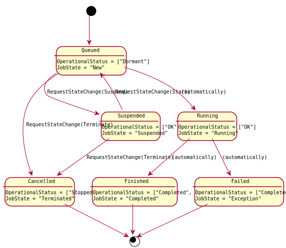
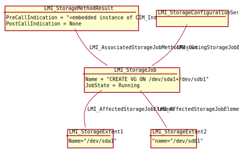
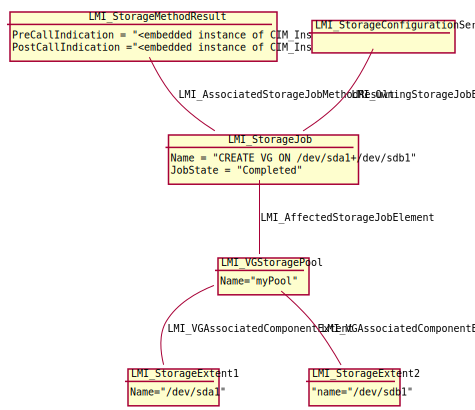

Asynchronous jobs
=================

Most of storage manipulation methods, for example
:ref:`CreateOrModifyVG <LMI-StorageConfigurationService-CreateOrModifyVG>`, can
be time-consuming. Therefore the methods only check input parameters and return
immediately with a reference to :ref:`LMI_StorageJob <LMI-StorageJob>`
instance. The operation itself is performed asynchronously on the server in a
separate thread.

The returned :ref:`LMI_StorageJob <LMI-StorageJob>` instance can be then used to
either pull the operation status or applications can subscribe for job events
and get an indication when status of a job changes.

Currently, only one job is being executed at a time, all others are enqueued and
executed later.

Job status
----------

The job status is exposed in
:ref:`OperationalStatus <CIM-ManagedSystemElement-OperationalStatus>` and
:ref:`JobState <CIM-ConcreteJob-JobState>` properties. Their combination
compose unique job status:

=========== ================= ==========
Job is      OperationalStatus JobState
=========== ================= ==========
Queued      Dormant           New
Suspended   OK                Suspended
Running     OK                Running
Finished OK Completed, OK     Completed
Failed      Completed, Error  Exception
Cancelled   Stopped           Terminated
=========== ================= ==========

:ref:`Job.RequestStateChange <CIM-ConcreteJob-RequestStateChange>` method can be
used to suspend, resume and cancel a job, while following rules apply:

* Only Queued job can be suspended.

* Only Suspended job can be resumed.

* Only Queued or Suspended job can be cancelled.

.. Note::

   Running job cannot be terminated in any way.

   Job state machine.

By default, all job instances disappear automatically after 60 seconds after
they reach any final state. This can be overridden by setting
:ref:`TimeBeforeRemoval <CIM-ConcreteJob-TimeBeforeRemoval>` and
:ref:`DeleteOnCompletion <CIM-Job-DeleteOnCompletion>` properties of a job.

Return value and output parameters
----------------------------------

Return value and output parameters of an asynchronous method call are stored in
:ref:`LMI_StorageJob.JobOutParameters <CIM-ConcreteJob-JobOutParameters>`
property, which is EmbeddedObject of a class, which has property for each output
parameter of the asynchronous method. The method return value itself is
available there too, as ``__ReturnValue`` property.

For compatibility with SMI-S, the output parameters are also included in
:ref:`LMI_StorageMethodResult.PostCallIndication <CIM-MethodResult-PostCallIndication>`
property, which is associated to the job. The property itself is embedded
instance of :ref:`CIM_InstMethodCall<CIM-InstMethodCall>` class. Return value
is stored in its :ref:`ReturnValue <CIM-InstMethodCall-ReturnValue>` property.
Output parameters are stored in its
:ref:`MethodParameters <CIM-InstMethodCall-MethodParameters>` property.

:ref:`LMI_AffectedStorageJobElement<LMI-AffectedStorageJobElement>` association
can be also used to find created/modified element of a
:ref:`LMI_StorageJob <LMI-StorageJob>` instance.

   Instance diagram of a job before finishing.

   Instance diagram of a job after finishing.

Supported event filters
-----------------------
.. _job_indications:

* PercentComplete property of a job changed::

    SELECT * FROM LMI_StorageInstModification
        WHERE SourceInstance ISA LMI_StorageJob
            AND SourceInstance.CIM_ConcreteJob::PercentComplete
                <> PreviousInstance.CIM_ConcreteJob::PercentComplete

* State of a job changed::

    SELECT FROM LMI_StorageInstModification
        WHERE SourceInstance ISA CIM_ConcreteJob
            AND SourceInstance.CIM_ConcreteJob::JobState <> PreviousInstance.CIM_ConcreteJob::JobState

* A job reaches state "Completed/OK"::

    SELECT * FROM LMI_StorageInstModification
        WHERE SourceInstance ISA LMI_StorageJob
            AND SourceInstance.CIM_ConcreteJob::JobState = 7

* A job reaches state "Completed/Error"::

    SELECT * FROM LMI_StorageInstModification
        WHERE SourceInstance ISA LMI_StorageJob
            AND SourceInstance.CIM_ConcreteJob::JobState = 10

* New job was created::

    SELECT * FROM LMI_StorageInstCreation WHERE SourceInstance ISA LMI_StorageJob

.. Note::

   All other indication filter queries will be rejected.
