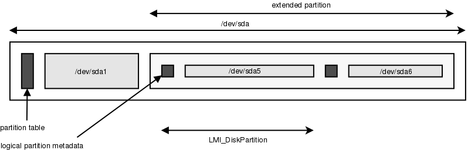

SMI-S Disk Partition Subprofile
===============================

Profile adjustment
------------------

The Disk Partition Subprofile does not reflect real-world MBR partition tables:

* The profile specifies, there can be up to 4 primary partitions (correct),
  one of them can be extended (correct) and up to 4 logical partitions can be
  instantiated on this extended partition (wrong, number of logical partitions
  is not limited).

* The profile specifies that logical partition metadata is on the beginning of
  the extended partition (see Figure 7 in the profile). In reality, each
  logical partition has its own metadata sector just before the partition. In
  addition, there can be number of empty sectors between the logical partition
  metadata and the partition beginning, which are left as result of alignment
  rules.

As result of this deficiency, some adjustments were necessary:

* The :ref:`LMI_DiskPartition <LMI-DiskPartition>` representing a logical
  partition *includes* the metadata sector and any alignment sectors.

 * :ref:`NumberOfBlocks <CIM-StorageExtent-NumberOfBlocks>` property
   *includes* the metadata and any alignment sectors.
 * :ref:`ConsumableBlocks <CIM-StorageExtent-ConsumableBlocks>` includes only
   the real usable data on partition.

   Correct overview of logical partitions.

GPT partition tables do not have these issues and are generally preferred over
MBR ones.

Implementation
--------------
All mandatory classes are implemented. However,
:ref:`CreateOrModifyPartition <LMI-DiskPartitionConfigurationService-CreateOrModifyPartition>`
method is *not* implemented. This function might be added in future.

The only way, how to create partitions is proprietary
:ref:`LMI_CreateOrModifyPartition <LMI-DiskPartitionConfigurationService-LMI-CreateOrModifyPartition>`,
which fits actual partitioning better.

Classes
^^^^^^^

Implemented SMI-S classes:

* :ref:`LMI_PartitionBasedOn <LMI-PartitionBasedOn>`

* :ref:`LMI_DiskPartition <LMI-DiskPartition>`

* :ref:`LMI_DiskPartitionConfigurationCapabilities <LMI-DiskPartitionConfigurationCapabilities>`

* :ref:`LMI_DiskPartitionConfigurationService <LMI-DiskPartitionConfigurationService>`

* :ref:`LMI_DiskPartitionElementCapabilities <LMI-DiskPartitionElementCapabilities>`

* :ref:`LMI_GenericDiskPartition <LMI-GenericDiskPartition>`

* :ref:`LMI_InstalledPartitionTable <LMI-InstalledPartitionTable>`

* :ref:`LMI_StorageExtent <LMI-StorageExtent>`

Additional implemented classes:

* :ref:`LMI_DiskPartitionConfigurationSetting <LMI-DiskPartitionConfigurationSetting>`

* :ref:`LMI_DiskPartitionElementSettingData <LMI-DiskPartitionElementSettingData>`

Not implemented classes:

* :ref:`CIM_GPTDiskPartition <CIM-GPTDiskPartition>`

* :ref:`CIM_LogicalDisk <CIM-LogicalDisk>`

* :ref:`CIM_VTOCDiskPartition <CIM-VTOCDiskPartition>`

* :ref:`CIM_SystemDevice <CIM-SystemDevice>`

* :ref:`CIM_HostedService <CIM-HostedService>`

Methods
^^^^^^^

Implemented:

* :ref:`SetPartitionStyle <CIM-DiskPartitionConfigurationService-SetPartitionStyle>`

* :ref:`LMI_CreateOrModifyPartition <LMI-DiskPartitionConfigurationService-LMI-CreateOrModifyPartition>`

Not implemented:

* :ref:`CreateOrModifyPartition <LMI-DiskPartitionConfigurationService-CreateOrModifyPartition>`

.. warning:: Mandatory indications are not
  implemented.

   Anaconda does not provide such functionality and it would be very
   CPU-intensive to periodically scan for new/deleted partitions.
