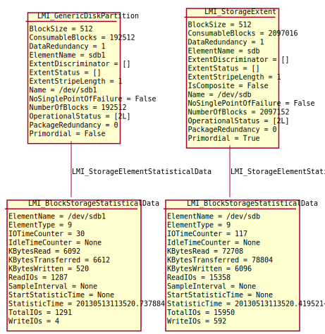
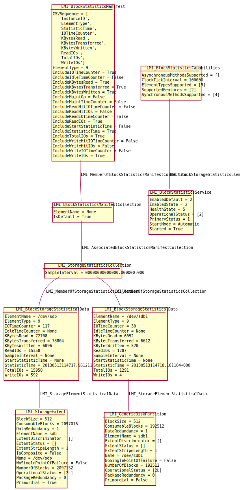

Block device performance
========================

OpenLMI-Storage provider reports I/O statistics of all block devices. Every
instance of :ref:`CIM_StorageExtent<CIM-StorageExtent>` or its subclass has
associated
:ref:`LMI_BlockStorageStatisticalData<LMI-BlockStorageStatisticalData>`
instance, which reports current I/O statistics like nr. of kbytes read/written
etc.

Following instance diagram shows two block devices and their associated
statistics:

There are many more classes related to block device performance, but these are
provided mainly for compatibility with SMI-S. See following instance diagram,
which shows the same two block devices, but now with all SMI-S classes:

The only useful method is
:ref:`LMI_BlockStatisticsService.GetStatisticsCollection<LMI-BlockStatisticsService-GetStatisticsCollection>`,
which returns I/O statistics of **all** block devices as
semicolon-separated-list. The order of fields in this list is described in
:ref:`LMI_BlockStatisticsManifest.CSVSequence<LMI-BlockStatisticsManifest-CSVSequence>`
property.

.. note::

   Even though properties in
   :ref:`LMI_BlockStorageStatisticalData<LMI-BlockStorageStatisticalData>`
   are 64-bit, they are tracked as 32-bit on 32-bit systems like ``i686`` or
   ``ppc`` by Linux kernel. They can wrap pretty quickly on modern hardware.

   For example, with iSCSI drive on 10Gb/s link, the KBytesRead counter can wrap
   in around 27 minutes.

   On 64-bit systems, these counters are tracked in 64-bits in Linux kernel
   and they wrap once in a few years.

Useful methods
--------------

:ref:`LMI_BlockStatisticsService.GetStatisticsCollection<LMI-BlockStatisticsService-GetStatisticsCollection>`
    Return I/O statistics of **all** block devices as CSV-formatted string.
    (CSV = semicolon-separated list).

    Note that this method is currently synchronous and does not return a
    ``Job``.

Use cases
---------

.. note::
   All example scripts expect :ref:`properly initialized lmishell <storage-shell-setup>`.

Get I/O statistics of a block device
^^^^^^^^^^^^^^^^^^^^^^^^^^^^^^^^^^^^

Find :ref:`LMI_BlockStorageStatisticalData<LMI-BlockStorageStatisticalData>`
associated to appropriate :ref:`CIM_StorageExtent<CIM-StorageExtent>`::

    # Find the /dev/sda3 device
    sda3 = ns.CIM_StorageExtent.first_instance({"Name": "/dev/sda3"})

    # Find its statistics
    stat = sda3.first_associator(ResultClass="LMI_BlockStorageStatisticalData")
    print "KBytesRead:", stat.KBytesRead

Get I/O statistics of all block devices I
^^^^^^^^^^^^^^^^^^^^^^^^^^^^^^^^^^^^^^^^^

Enumerate all
:ref:`LMI_BlockStorageStatisticalData<LMI-BlockStorageStatisticalData>`
instances on the system::

    # Find all LMI_BlockStorageStatisticalData instances
    stats = ns.LMI_BlockStorageStatisticalData.instances()
    for stat in stats:
        print "Device", stat.ElementName, "KBytesRead:", stat.KBytesRead

This approach can return huge list of
:ref:`LMI_BlockStorageStatisticalData<LMI-BlockStorageStatisticalData>`
instances on systems with lot of block devices.

Get I/O statistics of all block devices II
^^^^^^^^^^^^^^^^^^^^^^^^^^^^^^^^^^^^^^^^^^

Use
:ref:`LMI_BlockStatisticsService.GetStatisticsCollection<LMI-BlockStatisticsService-GetStatisticsCollection>`
method to get all statistics in one method call::

    # Print column headers
    manifest = ns.LMI_BlockStatisticsManifest.first_instance()
    print ";".join(manifest.CSVSequence)

    # Print the real data
    service = ns.LMI_BlockStatisticsService.first_instance()
    (ret, outparams, err) = service.GetStatisticsCollection()
    stats = outparams['Statistics']
    for stat in stats:
        print stat

Note that this method is currently synchronous and does not return a ``Job``.
