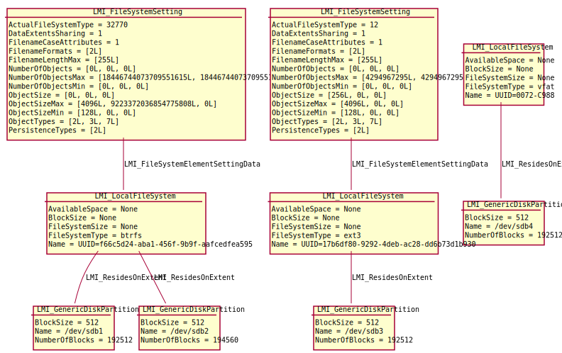

File system management
======================

Local file systems, both supported and unsupported, are represented by
:ref:`LMI_LocalFileSystem <LMI-LocalFileSystem>` class and its subclasses.

Each :ref:`LMI_LocalFileSystem <LMI-LocalFileSystem>` instance of supported
filesystems have associated one instance of
:ref:`LMI_FileSystemSetting <LMI-FileSystemSetting>` representing its
configuration (e.g. inode size).

Supported filesystems are: ext2, ext3, ext4, xfs, btrfs. Only supported
filesystems can be created! Actual set of supported filesystems can be obtained
from
:ref:`LMI_FileSystemConfigurationCapabilities <LMI-FileSystemConfigurationCapabilities>`
instance associated to
:ref:`LMI_FileSystemConfigurationService <LMI-FileSystemConfigurationService>`.

.. _diagram:

Following instance diagram shows four block devices:

*  ``/dev/sda1`` and ``/dev/sda2`` with btrfs filesystem spanning both these
   devices.
*  ``/dev/sda3`` with ext3 filesystem.
* ``/dev/sda4`` with msdos filesystems. The msdos filesystem is unsupported,
  therefore it has no :ref:`LMI_FileSystemSetting <LMI-FileSystemSetting>`
  associated.

.. Note::

   Currently the filesystem support is limited:

   * Filesystems can be only created and deleted, it is not possible to modify
     existing filesystem.
   * There is no way to set specific filesystem options
     when creating one. Simple ``mkfs.<filesystem type>`` is called, without any
     additional parameters.
   * btrfs filesystem can be only created or destroyed. There is currently no
     support for btrfs subvolumes, RAIDs, and dynamic addition or removal of
     block devices.
   * The :ref:`LMI_LocalFileSystem <LMI-LocalFileSystem>` instances do not
     report free and used space on the filesystems.
   
   These limitations will be addressed in future releases.   

Useful methods
--------------

:ref:`LMI_CreateFileSystem <LMI-FileSystemConfigurationService-LMI-CreateFileSystem>`
  Formats a StorageExtent with filesystem of given type. Currently the Goal
  parameter is not used, i.e. no filesystem options can be specified.

:ref:`DeleteFileSystem <LMI-FileSystemConfigurationService-DeleteFileSystem>`
  Destroys a file system (:ref:`LMI_LocalFileSystem <LMI-LocalFileSystem>`) or
  other metadata, such as Physical Volume metadata or MD RAID metadata present
  (:ref:`LMI_DataFormat<LMI-DataFormat>`) on a device.

  Only unmounted filesystems and unused metadata can be deleted.

Use cases
---------

.. note::
   All example scripts expect :ref:`properly initialized lmishell <storage-shell-setup>`.

.. _example-create-filesystem:

Create File System
^^^^^^^^^^^^^^^^^^

Use
:ref:`LMI_CreateFileSystem <LMI-FileSystemConfigurationService-LMI-CreateFileSystem>`
method. Following example formats ``/dev/sda3`` with ext3::

    filesystem_service = ns.LMI_FileSystemConfigurationService.first_instance()

    # Find the /dev/sda3 device
    sda3 = ns.CIM_StorageExtent.first_instance({"Name": "/dev/sda3"})

    # Format it
    (ret, outparams, err) = filesystem_service.SyncLMI_CreateFileSystem(
            FileSystemType=filesystem_service.LMI_CreateFileSystem.FileSystemTypeValues.EXT3,
            InExtents=[sda3])

The resulting filesystem is the same as shown in diagram_ above.

Create btrfs File System with two devices
^^^^^^^^^^^^^^^^^^^^^^^^^^^^^^^^^^^^^^^^^

Use the same
:ref:`LMI_CreateFileSystem <LMI-FileSystemConfigurationService-LMI-CreateFileSystem>`
method as above. Following example formats ``/dev/sda1`` and ``dev/sda2`` as
one btrfs volume::

   filesystem_service = ns.LMI_FileSystemConfigurationService.first_instance()

   # Find the /dev/sda1+2 devices
   sda1 = ns.CIM_StorageExtent.first_instance({"Name": "/dev/sda1"})
   sda2 = ns.CIM_StorageExtent.first_instance({"Name": "/dev/sda2"})

   # Format them
   (ret, outparams, err) = filesystem_service.SyncLMI_CreateFileSystem(
           FileSystemType=filesystem_service.LMI_CreateFileSystem.FileSystemTypeValues.BTRFS,
           InExtents=[sda1, sda2])

The resulting filesystem is the same as shown in diagram_ above.

Delete filesystem
^^^^^^^^^^^^^^^^^

Use
:ref:`LMI_CreateFileSystem <LMI-FileSystemConfigurationService-DeleteFileSystem>`
method::

    filesystem_service = ns.LMI_FileSystemConfigurationService.first_instance()

    sda1 = ns.CIM_StorageExtent.first_instance({"Name": "/dev/sda1"})
    fs = sda1.first_associator(ResultClass='LMI_LocalFileSystem')
    (ret, outparams, err) = filesystem_service.SyncDeleteFileSystem(
            TheFileSystem = fs)

Note that with one btrfs on multiple block devices, the whole btrfs volume is
destroyed.

Future direction
----------------

In future, we might implement:

* Add advanced options to
  :ref:`LMI_CreateFileSystem <LMI-FileSystemConfigurationService-LMI-CreateFileSystem>`

* Allow (some) filesystem modification, e.g. amount of reserved space for root
  user.

* Indications of various events, like filesystem is getting full.

