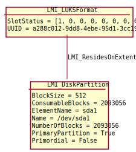
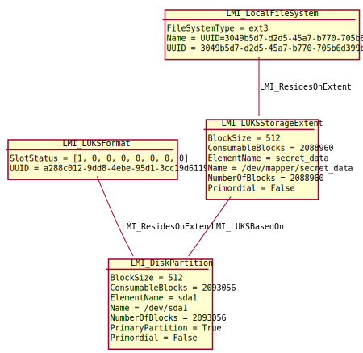

Storage encryption
===================

OpenLMI supports
`Linux Unified Key Setup <https://code.google.com/p/cryptsetup/>`_ (LUKS)
to encrypt block devices. This means any
device can be formatted with LUKS, which destroys
all data on the device and allows for encryption of the device future content.
The block device then contains *encrypted* data. To see unencrypted
(clear-text) data, the LUKS format must be *opened*. This operation creates
new block device, which contains the *clear-text* data. This device is just
regular block device and can be formatted with any filesystem. All write
operations are automatically encrypted and stored in the LUKS format data.

To hide the clear-text data, the clear text device must be *closed*. This
destroys the clear-text device, preserving only encrypted content in the
LUKS format data.

The data are encrypted by a key, which is accessible using a pass phrase.
There can be up to 8 different pass phrases per LUKS format. Any of them
can be used to open the format and to unencrypt the data.

.. Note::

   There is currently no way how to specify which algorithm, key or key size
   will be used to actually encrypt the data. *cryptsetup* defaults are
   applied.

:ref:`CIM_StorageExtent<CIM-StorageExtent>` can be recognized by
:ref:`LMI_LUKSFormat<LMI-LUKSFormat>` resides on it.

If the :ref:`LMI_LUKSFormat<LMI-LUKSFormat>` is opened, the new clear-text
device is created as :ref:`LMI_LUKSStorageExtent<LMI-LUKSStorageExtent>`,
which has ``BasedOn`` association to the original
:ref:`CIM_StorageExtent<CIM-StorageExtent>`.

All operations with LUKS format can be done using
:ref:`LMI_ExtentEncryptionConfigurationService<LMI-ExtentEncryptionConfigurationService>`.

.. _diagram1:

Following instance diagram shows one encrypted partition. The LUKS is not
opened, which means that there is no clear-text device on the system.

   Instance diagram of closed LUKS format on a partition.

.. _diagram2:

Following instance diagram shows one encrypted partition with opened LUKS.
That means any data written to ``/dev/mapper/cleartext`` are automatically
encrypted and stored on the partition.

   Instance diagram of opened LUKS format on a partition.

Useful methods
--------------

:ref:`CreateEncryptionFormat<LMI-ExtentEncryptionConfigurationService-CreateEncryptionFormat>`
  Formats a StorageExtent with LUKS format. All data on the device are
  destroyed.

:ref:`OpenEncryptionFormat <LMI-ExtentEncryptionConfigurationService-OpenEncryptionFormat>`
  *Opens* given LUKS format and shows its clear-text in
  :ref:`LMI_LUKSStorageExtent<LMI-LUKSStorageExtent>`.

:ref:`CloseEncryptionFormat <LMI-ExtentEncryptionConfigurationService-CloseEncryptionFormat>`
  *Closes* given LUKS format and destroys its previously opened
  :ref:`LMI_LUKSStorageExtent<LMI-LUKSStorageExtent>`.

:ref:`AddPassphrase<LMI-ExtentEncryptionConfigurationService-AddPassphrase>`, :ref:`DeletePassphrase<LMI-ExtentEncryptionConfigurationService-DeletePassphrase>`
  Manage pass phrases for given LUKS format.

Use cases
---------

Create encrypted file system.
^^^^^^^^^^^^^^^^^^^^^^^^^^^^^

Use
:ref:`CreateEncryptionFormat<LMI-ExtentEncryptionConfigurationService-CreateEncryptionFormat>`
to create LUKS format, open it and create ext3 filesystem on it::

    # Connect to the remote system and prepare some local variables
    connection = connect("remote.host.org", "root", "opensesame")
    ns = connection.root.cimv2  # ns as NameSpace
    encryption_service = ns.LMI_ExtentEncryptionConfigurationService.first_instance()
    filesystem_service = ns.LMI_FileSystemConfigurationService.first_instance()

    # Find the /dev/sda1 device
    sda1 = ns.CIM_StorageExtent.first_instance({"Name": "/dev/sdb1"})

    # Format it
    (ret, outparams, err) = encryption_service.SyncCreateEncryptionFormat(
        InExtent=sda1, Passphrase="opensesame")
    luks_format = outparams['Format'].to_instance()

    # 'Open' it as /dev/mapper/secret_data
    (ret, outparams, err) = encryption_service.SyncOpenEncryptionFormat(
        Format=luks_format,
        Passphrase="opensesame",
        ElementName="secret_data")
    clear_text_extent = outparams['Extent'].to_instance()

    # Format the newly created clear-text device
    (ret, outparams, err) = filesystem_service.SyncLMI_CreateFileSystem(
    FileSystemType=filesystem_service.LMI_CreateFileSystem.FileSystemTypeValues.EXT3,
    InExtents=[clear_text_extent])

The resulting situation is the same as shown in :ref:`the second diagram <diagram2>` above.

Close opened LUKS format
^^^^^^^^^^^^^^^^^^^^^^^^

:ref:`CloseEncryptionFormat <LMI-ExtentEncryptionConfigurationService-CloseEncryptionFormat>`
can be used to destroy the clear-text device so only encrypted data is available.
The clear-text device must be unmounted first!

::

    # Connect to the remote system and prepare some local variables
    connection = connect("remote.host.org", "root", "opensesame")
    ns = connection.root.cimv2  # ns as NameSpace
    encryption_service = ns.LMI_ExtentEncryptionConfigurationService.first_instance()

    # Find the LUKS format
    sda1 = ns.CIM_StorageExtent.first_instance({"Name": "/dev/sdb1"})
    luks_format = sda1.first_associator(AssocClass="LMI_ResidesOnExtent")

    # Close it
    (ret, outparams, err) = encryption_service.SyncCloseEncryptionFormat(
        Format=luks_format)

The resulting situation is the same as shown in :ref:`the first diagram<diagram1>` above.

Pass phrase management
^^^^^^^^^^^^^^^^^^^^^^

Pass phrases can be added or deleted using
:ref:`AddPassphrase<LMI-ExtentEncryptionConfigurationService-AddPassphrase>`
and
:ref:`DeletePassphrase<LMI-ExtentEncryptionConfigurationService-DeletePassphrase>`
methods.

Following code can be used to replace weak 'opensesame' password with something
stronger::

    # Connect to the remote system and prepare some local variables
    connection = connect("remote.host.org", "root", "opensesame")
    ns = connection.root.cimv2  # ns as NameSpace
    encryption_service = ns.LMI_ExtentEncryptionConfigurationService.first_instance()

    # Find the LUKS format
    sda1 = ns.CIM_StorageExtent.first_instance({"Name": "/dev/sdb1"})
    luks_format = sda1.first_associator(AssocClass="LMI_ResidesOnExtent")

    # Add a pass phrase
    (ret, outparams, err) = encryption_service.AddPassphrase(
            Format=luks_format,
            Passphrase="opensesame",
            NewPassphrase="o1mcW+O27F")

    # Remove the old weak one
    (ret, outparams, err) = encryption_service.DeletePassphrase(
            Format=luks_format,
            Passphrase="opensesame")

There are 8 so called key slots, which means each LUKS formats supports up to 8
different pass phrases. Any of the pass phrases can be used to open the LUKS
format. Status of these key slots can be found in
:ref:`LMI_LUKSFormat.SlotStatus<LMI-LUKSFormat-SlotStatus>` property.
