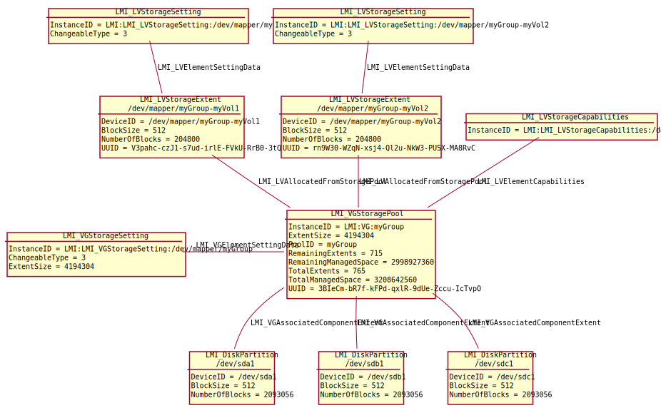
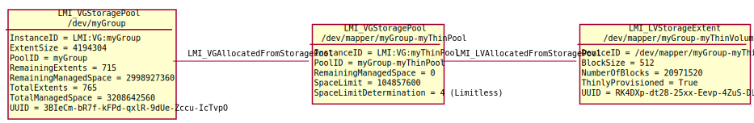

Logical Volume management
=========================

OpenLMI storage provider supports basic LVM operations, incl. thin pool
management. See `Red Hat documentation`_ for LVM terminology, architecture and
usage from command line (note that the information there apply also to
other Linux distributions).

.. _Red Hat documentation: https://access.redhat.com/documentation/en-US/Red_Hat_Enterprise_Linux/7/html/Logical_Volume_Manager_Administration/LVM_overview.html

Volume Groups (VG) and Thin Pools (TP) are represented by
:ref:`LMI_VGStoragePool <LMI-VGStoragePool>` class. To differentiate between the
two, `SpaceLimitDetermination` and `SpaceLimit` are both set or both empty.

If both are set, an instance of the class is a thin pool.
`SpaceLimitDetermination` is always set to 4 (limitless thin pool, meaning that
it can be overcommited) and `SpaceLimit` is set to the capacity of the storage
allocated to the pool.  Also, `RemainingManagedSpace` will be set to the
remaining space on the pool.  Due to the current limitation of the underlying
storage library, if the pool is overcommited, its `RemainingManagedSpace` value
is set to 0.

If both `SpaceLimitDetermination` and `SpaceLimit` are empty, the instance of the
:ref:`LMI_VGStoragePool <LMI-VGStoragePool>` class is a regular volume group.

Every :ref:`LMI_VGStoragePool <LMI-VGStoragePool>` instance has associated one
instance of :ref:`LMI_VGStorageSetting <LMI-VGStorageSetting>` representing its
configuration (e.g. volume group extent size) and one instance of
:ref:`LMI_LVStorageCapabilities <LMI-LVStorageCapabilities>`, representing its
ability to create logical volumes (for SMI-S applications).
Every :ref:`LMI_VGStoragePool <LMI-VGStoragePool>` instance, if it is a thin
pool, is associated with its thin logical volumes (if they exist) using
:ref:`LMI_VGAllocatedFromStoragePool <LMI-VGAllocatedFromStoragePool>`.

Physical Volumes (PV) are associated to VGs using
:ref:`LMI_VGAssociatedComponentExtent <LMI-VGAssociatedComponentExtent>`
association.

Logical Volumes (LV) and Thin Logical Volumes (TLV) are represented by
:ref:`LMI_LVStorageExtent <LMI-LVStorageExtent>` class. If an instance of the
class is a thin logical volume, `ThinlyProvisioned` is set to True.

Each :ref:`LMI_LVStorageExtent <LMI-LVStorageExtent>` instance is associated to
its respective VG/TP using :ref:`LMI_LVAllocatedFromStoragePool
<LMI-LVAllocatedFromStoragePool>` association.

In addition, LVs are associated to all PVs using
:ref:`LMI_LVBasedOn <LMI-LVBasedOn>` association.

.. _diagram:

Following instance diagram shows one Volume Group ``/dev/myGroup`` based on
three Physical Volumes ``/dev/sda1``, ``/dev/sdb1`` and ``/dev/sdc1`` and two
Logical Volumes ``myVol1`` and ``myVol2``.

Note that the diagram is simplified and does not show
:ref:`LMI_LVBasedOn <LMI-LVBasedOn>` association, which associates every
``myVolY`` to ``/dev/sdX1``.

The next instance diagram displays the Volume Group ``/dev/myGroup`` (see
previous diagram_) that has ``myThinPool``, sized 100 MiB, associated to it.
This Thin Pool is used to provision the 10 GiB Thin Logical Volume
``/dev/mapper/myGroup-myThinVolume``. The VG/TP pair is connected with an
:ref:`LMI_VGAllocatedFromStoragePool <LMI-VGAllocatedFromStoragePool>`
association. :ref:`LMI_LVAllocatedFromStoragePool
<LMI-LVAllocatedFromStoragePool>` association joins the TP/TLV pair.

Currently the LVM support is limited to creation and removal of VGs and LVs and
to adding/removing devices to/from a VG. It is not possible to modify existing
LV, e.g. or resize LVs. In future OpenLMI may be extended to have more
configuration options in :ref:`LMI_VGStorageSetting <LMI-VGStorageSetting>` and
:ref:`LMI_LVStorageSetting <LMI-LVStorageSetting>`.

Useful methods
--------------

:ref:`CreateOrModifyVG <LMI-StorageConfigurationService-CreateOrModifyVG>`
  Creates a Volume Group with given devices. The devices are automatically
  formatted with Physical Volume metadata. Optionally, the Volume Group extent
  size can be specified by using Goal parameter of the method.

  This method can be also used to add/remove PVs to/from VG.

:ref:`CreateOrModifyThinPool <LMI-StorageConfigurationService-CreateOrModifyThinPool>`
  Creates or modifies a Thin Pool.

:ref:`CreateOrModifyThinLV <LMI-StorageConfigurationService-CreateOrModifyThinLV>`
  Create or modifies a Thin Logical Volume.

:ref:`CreateOrModifyStoragePool <LMI-StorageConfigurationService-CreateOrModifyStoragePool>`
  Creates a Volume Group in SMI-S way.

:ref:`CreateVGStorageSetting <LMI-VGStorageCapabilities-CreateVGStorageSetting>`
  This is helper method to calculate
  :ref:`LMI_VGStorageSetting <LMI-VGStorageSetting>` for given list of devices
  for
  :ref:`CreateOrModifyStoragePool <LMI-StorageConfigurationService-CreateOrModifyStoragePool>`
  method.

:ref:`CreateOrModifyLV <LMI-StorageConfigurationService-CreateOrModifyLV>`
  Creates a Logical Volume from given VG.

:ref:`CreateOrModifyElementFromStoragePool <LMI-StorageConfigurationService-CreateOrModifyElementFromStoragePool>`
  Creates a Logical Volume in SMI-S way.

:ref:`DeleteLV <LMI-StorageConfigurationService-DeleteLV>`
  Destroys a Logical Volume or a Thin Logical Volume.

:ref:`ReturnToStoragePool <CIM-StorageConfigurationService-ReturnToStoragePool>`
  Destroys a Logical Volume in SMI-S way.

:ref:`DeleteVG <LMI-StorageConfigurationService-DeleteVG>`
  Destroys a Volume Group or a Thin Pool.

:ref:`DeleteStoragePool <CIM-StorageConfigurationService-DeleteStoragePool>`
  Destroys a Volume Group in SMI-S way.

Use cases
---------

.. note::
   All example scripts expect :ref:`properly initialized lmishell <storage-shell-setup>`.

Create Volume Group
^^^^^^^^^^^^^^^^^^^

Use :ref:`CreateOrModifyVG <LMI-StorageConfigurationService-CreateOrModifyVG>`
method. Following example creates a VG '/dev/myGroup' with three members and
with default extent size (4MiB)::

    storage_service = ns.LMI_StorageConfigurationService.first_instance()

    # Find the devices we want to add to VG
    # (filtering one CIM_StorageExtent.instances()
    # call would be faster, but this is easier to read)
    sda1 = ns.CIM_StorageExtent.first_instance({"Name": "/dev/sda1"})
    sdb1 = ns.CIM_StorageExtent.first_instance({"Name": "/dev/sdb1"})
    sdc1 = ns.CIM_StorageExtent.first_instance({"Name": "/dev/sdc1"})

    # Create the VG
    (ret, outparams, err) = storage_service.SyncCreateOrModifyVG(
            ElementName="myGroup",
            InExtents=[sda1, sdb1, sdc1])
    vg = outparams['Pool'].to_instance()
    print "VG", vg.PoolID, \
            "with extent size", vg.ExtentSize, \
            "and",  vg.RemainingExtents, "free extents created." 

The resulting VG is the same as shown in diagram_ above, except it does not have
any LVs yet.

Create Thin Pool
^^^^^^^^^^^^^^^^

The VG from the previous example can be used to create a TP on. This example
script creates a Thin Pool 'myThinPool' on the VG 'myGroup'. The TP is 100 MiB
in size::

    storage_service = ns.LMI_StorageConfigurationService.first_instance()
    MEGABYTE = 1024*1024

    # Find the volume group
    vg = ns.LMI_VGStoragePool.first_instance({"InstanceID":"LMI:VG:myGroup"})

    # Allocate a thin pool out of it
    (ret, outparams, err) = storage_service.SyncCreateOrModifyThinPool(
            ElementName="myThinPool",
            InPool=vg.path,
            # 100 MiB
            Size=100 * MEGABYTE)
    tp = outparams["Pool"].to_instance()
    print "TP %s with %d MiB remaining" % \
            (tp.Name, tp.RemainingManagedSpace / MEGABYTE)

Create Volume Group in SMI-S way
^^^^^^^^^^^^^^^^^^^^^^^^^^^^^^^^

SMI-S applications can use
:ref:`CreateOrModifyStoragePool <LMI-StorageConfigurationService-CreateOrModifyStoragePool>`
method. Following example creates a VG '/dev/myGroup' with three members and
with default extent size (4MiB)::

    storage_service = ns.LMI_StorageConfigurationService.first_instance()

    # Find the devices we want to add to VG
    # (filtering one CIM_StorageExtent.instances()
    # call would be faster, but this is easier to read)
    sda1 = ns.CIM_StorageExtent.first_instance({"Name": "/dev/sda1"})
    sdb1 = ns.CIM_StorageExtent.first_instance({"Name": "/dev/sdb1"})
    sdc1 = ns.CIM_StorageExtent.first_instance({"Name": "/dev/sdc1"})

    # Create the VG
    (ret, outparams, err) = storage_service.SyncCreateOrModifyStoragePool(
            InExtents=[sda1, sdb1, sdc1],
            ElementName="myGroup")
    vg = outparams['Pool'].to_instance()
    print "VG", vg.PoolID, \
            "with extent size", vg.ExtentSize, \
            "and",  vg.RemainingExtents, "free extents created." 

The resulting VG is the same as shown in diagram_ above, except it does not have
any LVs yet.

Add and remove devices to/from a Volume Group
^^^^^^^^^^^^^^^^^^^^^^^^^^^^^^^^^^^^^^^^^^^^^

:ref:`CreateOrModifyStoragePool <LMI-StorageConfigurationService-CreateOrModifyStoragePool>`
can be used to modify exising VG. Its 'InExtents' parameter specifies
new list of Physical Volumes of the VG. When an PV is being removed
from a VG, all its data are safely moved to a free PV.

Continuing with previous example, let's remove '/dev/sda1' from the VG and
add '/dev/sdd1' to it::

    storage_service = ns.LMI_StorageConfigurationService.first_instance()

    # Find all the devices we want to be in VG
    # (filtering one CIM_StorageExtent.instances()
    # call would be faster, but this is easier to read)
    sdb1 = ns.CIM_StorageExtent.first_instance({"Name": "/dev/sdb1"})
    sdc1 = ns.CIM_StorageExtent.first_instance({"Name": "/dev/sdc1"})
    sdd1 = ns.CIM_StorageExtent.first_instance({"Name": "/dev/sdd1"})

    new_pvs = [sdb1, sdc1, sdd1]              # Without sda1!

    # Find the VG
    vg = ns.LMI_VGStoragePool.first_instance({"Name": "/dev/mapper/myGroup"})

    # Set the list of PVs of the VG.
    # All existing PVs, which are not listed in InExtents parameter will
    # be removed from the VG. All new devices listed in InExtents parameter
    # are added to the VG. All data in the VG are moved from the PVs being
    # removed to a free PV, no data is lost.

    (ret, outparams, err) = storage_service.SyncCreateOrModifyVG(
            InExtents=new_pvs,
            pool=vg.path)

Create Volume Group with specific extent size
^^^^^^^^^^^^^^^^^^^^^^^^^^^^^^^^^^^^^^^^^^^^^

Use
:ref:`CreateVGStorageSetting <LMI-VGStorageCapabilities-CreateVGStorageSetting>`
to create :ref:`LMI_VGStorageSetting <LMI-VGStorageSetting>`, modify its
:ref:`ExtentSize <LMI-VGStorageSetting-ExtentSize>` property with desired
extent size and finally call
:ref:`CreateOrModifyVG <LMI-StorageConfigurationService-CreateOrModifyVG>` with
the setting as ``Goal`` parameter. Following example creates a VG
'/dev/myGroup' with three members and with 1MiB extent size (4MiB)::

    storage_service = ns.LMI_StorageConfigurationService.first_instance()
    MEGABYTE = 1024*1024

    # Find the devices we want to add to VG
    # (filtering one CIM_StorageExtent.instances()
    # call would be faster, but this is easier to read)
    sda1 = ns.CIM_StorageExtent.first_instance({"Name": "/dev/sda1"})
    sdb1 = ns.CIM_StorageExtent.first_instance({"Name": "/dev/sdb1"})
    sdc1 = ns.CIM_StorageExtent.first_instance({"Name": "/dev/sdc1"})

    # Create the LMI_VGStorageSetting
    vg_caps = ns.LMI_VGStorageCapabilities.first_instance()
    (ret, outparams, err) = vg_caps.CreateVGStorageSetting(
            InExtents = [sda1, sdb1, sdc1])
    setting = outparams['Setting'].to_instance()
    # Modify the LMI_VGStorageSetting
    setting.ExtentSize = MEGABYTE
    settinh.push()

    # Create the VG
    # (either of CreateOrModifyStoragePool or CreateOrModifyVG
    # can be used with the same result) 
    (ret, outparams, err) = storage_service.SyncCreateOrModifyStoragePool(
            InExtents=[sda1, sdb1, sdc1],
            ElementName="myGroup",
            Goal=setting)
    vg = outparams['Pool'].to_instance()
    print "VG", vg.PoolID, \
            "with extent size", vg.ExtentSize, \
            "and",  vg.RemainingExtents, "free extents created." 
    
List Physical Volumes of a Volume Group
^^^^^^^^^^^^^^^^^^^^^^^^^^^^^^^^^^^^^^^

Enumerate :ref:`VGAssociatedComponentExtent <LMI-VGAssociatedComponentExtent>`
associations of the VG.

Following code lists all PVs of ``/dev/myGroup``::

    # Find the VG
    vg = ns.LMI_VGStoragePool.first_instance({"Name": "/dev/mapper/myGroup"})
    pvs = vg.associators(AssocClass="LMI_VGAssociatedComponentExtent")
    for pv in pvs:
        print "Found PV", pv.DeviceID

Create Logical Volume
^^^^^^^^^^^^^^^^^^^^^

Use :ref:`CreateOrModifyLV <LMI-StorageConfigurationService-CreateOrModifyLV>`
method. Following example creates two 100MiB volumes::

    storage_service = ns.LMI_StorageConfigurationService.first_instance()
    MEGABYTE = 1024*1024

    # Find the VG
    vg = ns.LMI_VGStoragePool.first_instance({"Name": "/dev/mapper/myGroup"})

    # Create the LV
    (ret, outparams, err) = storage_service.SyncCreateOrModifyLV(
            ElementName="Vol1",
            InPool=vg,
            Size=100 * MEGABYTE)
    lv = outparams['TheElement'].to_instance()
    print "LV", lv.DeviceID, \
            "with", lv.BlockSize * lv.NumberOfBlocks,\
            "bytes created."

    # Create the second LV
    (ret, outparams, err) = storage_service.SyncCreateOrModifyLV(
            ElementName="Vol2",
            InPool=vg,
            Size=100 * MEGABYTE)
    lv = outparams['TheElement'].to_instance()
    print "LV", lv.DeviceID, \
            "with", lv.BlockSize * lv.NumberOfBlocks, \
            "bytes created."

The resulting LVs are the same as shown in diagram_ above.

Create Thin Logical Volume
^^^^^^^^^^^^^^^^^^^^^^^^^^

The following example assumes that a TP was already created (see `Create Thin Pool`_).

There already is a TP (100 MiB) in the system. This snippet of code creates a 10
GiB Thin Logical Volume and prints some information about it. Note that this TLV
causes the underlying TP to be overcommited::

    storage_service = ns.LMI_StorageConfigurationService.first_instance()

    # Find the thin pool
    tp = ns.LMI_VGStoragePool.first_instance({"ElementName":"myThinPool"})

    (ret, outparams, err) = storage_service.SyncCreateOrModifyThinLV(
            ElementName="myThinLV",
            ThinPool=tp.path,
            # 10 GiB
            Size=10 * GIGABYTE)
    tlv = outparams["TheElement"].to_instance()
    print "TLV %s of size %d GiB" % \
           (tlv.Name, tlv.BlockSize * tlv.NumberOfBlocks / GIGABYTE)

Create Logical Volume in SMI-S way
^^^^^^^^^^^^^^^^^^^^^^^^^^^^^^^^^^

Use
:ref:`CreateOrModifyElementFromStoragePool <LMI-StorageConfigurationService-CreateOrModifyElementFromStoragePool>`
method. The code is the same as in previous sample, just different method is
used::

    storage_service = ns.LMI_StorageConfigurationService.first_instance()
    MEGABYTE = 1024*1024

    # Find the VG
    vg = ns.LMI_VGStoragePool.first_instance({"Name": "/dev/mapper/myGroup"})

    # Create the LV
    (ret, outparams, err) = storage_service.SyncCreateOrModifyElementFromStoragePool(
            ElementName="Vol1",
            InPool=vg,
            Size=100 * MEGABYTE)
    lv = outparams['TheElement'].to_instance()
    print "LV", lv.DeviceID, \
            "with", lv.BlockSize * lv.NumberOfBlocks,\
            "bytes created."

    # Create the second LV
    (ret, outparams, err) = storage_service.SyncCreateOrModifyElementFromStoragePool(
            ElementName="Vol2",
            InPool=vg,
            Size=100 * MEGABYTE)
    lv = outparams['TheElement'].to_instance()
    print "LV", lv.DeviceID, \
            "with", lv.BlockSize * lv.NumberOfBlocks, \
            "bytes created."

Delete VG
^^^^^^^^^

Call :ref:`DeleteVG <LMI-StorageConfigurationService-DeleteVG>` method::

    storage_service = ns.LMI_StorageConfigurationService.first_instance()

    vg = ns.LMI_VGStoragePool.first_instance({"Name": "/dev/mapper/myGroup"})
    (ret, outparams, err) = storage_service.SyncDeleteVG(
            Pool = vg)

Delete LV
^^^^^^^^^

Call :ref:`DeleteLV <LMI-StorageConfigurationService-DeleteLV>` method::

   storage_service = ns.LMI_StorageConfigurationService.first_instance()

   lv = ns.LMI_LVStorageExtent.first_instance({"Name": "/dev/mapper/myGroup-Vol2"})
   (ret, outparams, err) = storage_service.SyncDeleteLV(
           TheElement=lv)

Future direction
----------------

In future, we might implement:

* Modification of existing VGs and LVs, for example renaming VGs and LVs
  and resizing LVs.

* LVs with stripping and mirroring.

* Clustered VGs and LVs.

* Snapshots.

* Indications of various events.

