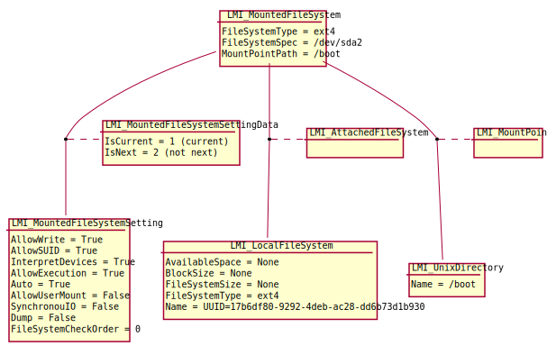
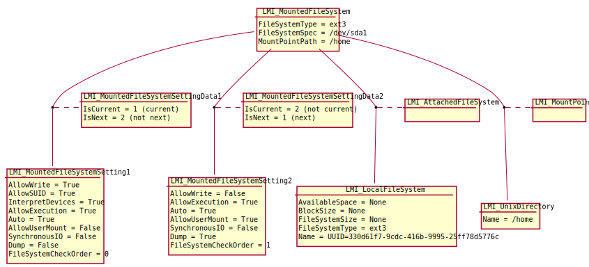
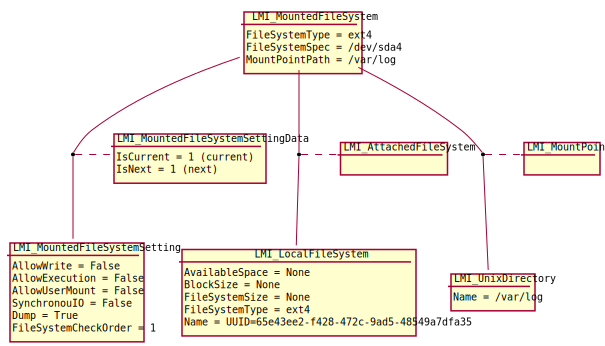

========
Mounting
========

.. note::

   Currently, only basic mounting/unmounting works. Persistency and mount flags
   (i.e. bind) are not implemented, yet. These limitations will be addressed
   in the future releases.

Every mount is represented by an
:ref:`LMI_MountedFileSystem <LMI-MountedFileSystem>`
instance. Each instance can have one or two
:ref:`LMI_MountedFileSystemSetting <LMI-MountedFileSystemSetting>` instances
associated to it via
:ref:`LMI_MountedFileSystemElementSettingData <LMI-MountedFileSystemElementSettingData>`
(one for the currently mounted filesystem and one for a persistent entry in
/etc/fstab). This association class has two important properties --
:ref:`IsCurrent <CIM-ElementSettingData-IsCurrent>`
and
:ref:`IsNext <CIM-ElementSettingData-IsNext>`
. Their meaning is described in detail in the `On modes`_ section.

:ref:`LMI_MountedFileSystemSetting <LMI-MountedFileSystemSetting>` is used for
representing mount options (e.g. whether to mount read-write or read-only).

The setting instance can also exists on its own. This means that it's not
connected with
:ref:`LMI_MountedFileSystem <LMI-MountedFileSystem>`
by any association. Such situation can
happen after
:ref:`CreateSetting <LMI-MountedFileSystemCapabilities-CreateSetting>`
is called. According to its
:ref:`ChangeableType <CIM-SettingData-ChangeableType>`
property, it is either deleted after an hour (ChangeableType = Transient), or
has to be associated or deleted manually (Changeable = Persistent).

Local filesystems are represented by
:ref:`LMI_LocalFileSystem <LMI-LocalFileSystem>` class and its
subclasses. Filesystems are associated to
:ref:`LMI_MountedFileSystem <LMI-MountedFileSystem>`
via
:ref:`LMI_AttachedFileSystem <LMI-AttachedFileSystem>`
.

.. note::

   Currently, only local filesystems are supported.

.. Following line produces "WARNING: undefined label: LMI-UnixDirectory" in
   storage docs, but the links is useful in overall documentation.

When a filesystem is currently mounted, the directory where the
:ref:`LMI_MountedFileSystem <LMI-MountedFileSystem>`
instance is attached at is represented by an
:ref:`LMI_UnixDirectory <LMI-UnixDirectory>`
instance. These two instances are connected through an
:ref:`LMI_MountPoint <LMI-MountPoint>`
association instance.

The following diagram shows a local ext4 partition /dev/sda2 currently mounted
at /boot. The filesystem is specified by its UUID. No persitent entry in
/etc/fstab is managed.

The next figure shows a local ext3 partition /dev/sda1 mounted at /home and also
made persistent in /etc/fstab, both with slightly different mount options. The
filesystem is specified by its UUID. Notice that the mount options are
represented by two different
:ref:`LMI_MountedFileSystemSetting <LMI-MountedFileSystemSetting>`
instances.

The final diagram represents a state where a local ext4 partition /dev/sda4,
filesystem of which is specified by its UUID, is mounted at /var/log and also
has the respective entry written in /etc/fstab. Note that both settings (current
mount and the persistent entry) are the same, as is indicated by IsNext and
IsCurrent being set to 1.

.. note::

   TODO: bind mount examples, remote fs examples

Using the mounting API
======================

On modes
--------
When calling
:ref:`CreateMount <LMI-MountConfigurationService-CreateMount>` or
:ref:`DeleteMount <LMI-MountConfigurationService-DeleteMount>`
methods, one of their arguments is a mode. The mode is an enumeration that
denotes values of two different properties of the
:ref:`LMI_MountedFileSystemElementSettingData <LMI-MountedFileSystemElementSettingData>`
association.  They are
:ref:`IsNext <CIM-ElementSettingData-IsNext>` and
:ref:`IsCurrent <CIM-ElementSettingData-IsCurrent>`.
They determine if the mount operation performs mount only, adds a persistent
entry to /etc/fstab, or both.

The following table displays possible values and their respective meanings of
:ref:`IsNext <CIM-ElementSettingData-IsNext>`
and
:ref:`IsCurrent <CIM-ElementSettingData-IsCurrent>`
.

.. table::

   +-----------+-------+-------------------------------------------------------------------------------+
   |           | Value | Meaning                                                                       |
   +===========+=======+===============================================================================+
   |           |       | This property indicates if the associated setting will be applied as mount    |
   |           |     1 | options on next reinitialization, i.e. on reboot. In mounting this means      |
   |           |       | persistency, an entry in /etc/fstab.                                          |
   | IsNext    +-------+-------------------------------------------------------------------------------+
   |           |     2 | No entry in /etc/fstab.                                                       |
   +-----------+-------+-------------------------------------------------------------------------------+
   |           |     1 | This property indicates if the associated setting represents current mount    |
   |           |       | options of the MountedFileSystem.                                             |
   | IsCurrent +-------+-------------------------------------------------------------------------------+
   |           |     2 | The device is not mounted.                                                    |
   +-----------+-------+-------------------------------------------------------------------------------+

**Supported modes** of
:ref:`CreateMount <LMI-MountConfigurationService-CreateMount>`,
:ref:`ModifyMount <LMI-MountConfigurationService-ModifyMount>` and
:ref:`DeleteMount <LMI-MountConfigurationService-DeleteMount>`
methods and their meaning are described in the following table. See decription of
the methods for details.

.. table::

   ======== =============== ===============
   Mode     IsNext          IsCurrent
   ======== =============== ===============
         1               1               1
         2               1   Not affected.
         4               2               2
         5               2   Not affected.
     32768   Not affected.               1
     32769   Not affected.               2
   ======== =============== ===============

Methods
-------
:ref:`CreateMount <LMI-MountConfigurationService-CreateMount>`
   Mounts a device to the specified mountpoint.

:ref:`ModifyMount <LMI-MountConfigurationService-ModifyMount>`
   Modifies (remounts) the specified filesystem.

:ref:`DeleteMount <LMI-MountConfigurationService-DeleteMount>`
   Unmounts the specified filesystem.

All the methods are asynchronous.

DeleteMount() note
------------------
If, after
:ref:`DeleteMount <LMI-MountConfigurationService-DeleteMount>`,
:ref:`IsNext <CIM-ElementSettingData-IsNext>` and
:ref:`IsCurrent <CIM-ElementSettingData-IsCurrent>`
are both set to 2 (device was unmounted and its persistent
entry removed), the corresponding
:ref:`LMI_MountedFileSystem <LMI-MountedFileSystem>`,
:ref:`LMI_MountedFileSystemSetting <LMI-MountedFileSystemSetting>`
and their association are removed. This implies that there cannot be any
:ref:`LMI_MountedFileSystemElementSettingData <LMI-MountedFileSystemElementSettingData>`
with both
:ref:`IsNext <CIM-ElementSettingData-IsNext>` and
:ref:`IsCurrent <CIM-ElementSettingData-IsCurrent>`
set to 2.

Use cases
=========
Typical use of the mounting API could be like the following:

Use an
:ref:`LMI_MountedFileSystemCapabilities <LMI-MountedFileSystemCapabilities>`
instance to create a setting instance using the
:ref:`CreateSetting <LMI-MountedFileSystemCapabilities-CreateSetting>`
method. This method creates an instance of
:ref:`LMI_MountedFileSystemSetting <LMI-MountedFileSystemSetting>`
class with default property values.

Modify the setting instance as needed. This is done using the ModifyInstance
intrinsic method. This step is optional if the admin is satisfied with the
default set of values.

Use an
:ref:`LMI_MountConfigurationService <LMI-MountConfigurationService>`
to create a mount using the
:ref:`CreateMount <LMI-MountConfigurationService-CreateMount>`
method or modify a mount using the
:ref:`ModifyMount <LMI-MountConfigurationService-ModifyMount>`
method. You can also use an
:ref:`LMI_MountConfigurationService <LMI-MountConfigurationService>`
to unmount a mount using the
:ref:`DeleteMount <LMI-MountConfigurationService-DeleteMount>`
.

.. _example-create-mount:

Example 1
---------
This example demonstrates mounting /dev/sda partition with a customized setting.

::

   # Connect to the remote system and prepare some local variables
   connection = connect("remote.host.org", "root", "opensesame")
   ns = connection.root.cimv2  # ns as NameSpace

   cap = ns.LMI_MountedFileSystemCapabilities.first_instance()

   # Create an LMI_MountedFileSystemSetting instance
   (rc, out, err) = cap.CreateSetting()
   setting_name = out['Setting']
   setting = setting_name.to_instance()

   # Modify the setting instance with requested options
   setting.AllowWrite = False
   setting.InterpretDevices = False
   setting.push()

   # Find the filesystem to mount
   sda1 = ns.CIM_StorageExtent.first_instance({"Name": "/dev/sda1"})
   fs = sda1.first_associator(ResultClass='LMI_LocalFileSystem')

   # Mount it
   # Mode == 32768 -> only mount, no fstab entry
   mount_service = ns.LMI_MountConfigurationService.first_instance()
   (rc, out, err) = mount_service.SyncCreateMount(
        Goal=setting,
        FileSystemType='ext4',
        Mode=32768,
        FileSystem=fs,
        MountPoint='/mnt/test',
        FileSystemSpec='/dev/sda1')

Example 2
---------
In this example, /mnt, that was mounted in Example 1, is unmounted.

::

   # Connect to the remote system and prepare some local variables
   connection = connect("remote.host.org", "root", "opensesame")
   ns = connection.root.cimv2  # ns as NameSpace
   mount_service = ns.LMI_MountConfigurationService.first_instance()

   mnt = ns.LMI_MountedFileSystem.first_instance({"MountPointPath": "/mnt/test"})

   if not mnt:
       raise BaseException("Mountpoint does not exist: /mnt/test")

   (rc, out, err) = mount_service.SyncDeleteMount(
        Mount=mnt,
        Mode=32769)

.. note::

   Currently, only basic mounting/unmounting works. Persistency and mount flags
   (i.e. bind) are not implemented, yet. These limitations will be addressed in
   the future releases.
