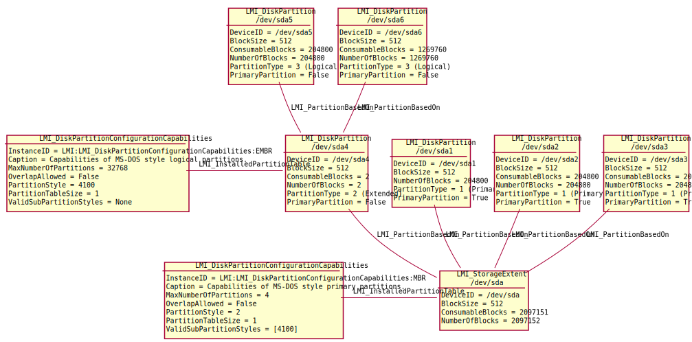

Partitioning
============

Disks or any other block devices with partition tables have their
:ref:`LMI_StorageExtent <LMI-StorageExtent>` or its subclass associated to
:ref:`LMI_DiskPartitionConfigurationCapabilities <LMI-DiskPartitionConfigurationCapabilities>`
using :ref:`LMI_InstalledPartitionTable <LMI-InstalledPartitionTable>`.

A GPT partition present on a block device are represented as
:ref:`LMI_GenericDiskPartition <LMI-GenericDiskPartition>`.

A MS-DOS partition present on a block device are represented as
:ref:`LMI_DiskPartition <LMI-DiskPartition>`.

Both MS-DOS and GPT partitions are associated to the parent device using
:ref:`LMI_PartitionBasedOn <LMI-PartitionBasedOn>`. This BasedOn association
contains also start and end sectors of the partitions. Note that logical
partitions are associated with the extended partition where they are located,
see the diagram below.

.. _diagram:

Following instance diagram shows ``/dev/sda`` disk with MS-DOS partition table
and:

* 3 primary partitions

* 1 extended partition

  * 2 logical partitions

Especially note that the extended partition ``/dev/sda4`` *contains* an extended
partition table and all logical partitions are based on this extended
partition. This is for compatibility with SMI-S and also it better illustrates
physical composition of the partitions on the disk.

However, to create a partition on the device, applications can use both
``/dev/sda`` or ``/dev/sda4`` as value of ``Extent`` parameter in
:ref:`LMI_CreateOrModifyPartition <LMI-DiskPartitionConfigurationService-LMI-CreateOrModifyPartition>`,
call.

Useful methods
--------------

:ref:`LMI_CreateOrModifyPartition <LMI-DiskPartitionConfigurationService-LMI-CreateOrModifyPartition>`
  Creates a partition of given size on a device with GPT or MS-DOS partition
  table. It can automatically create extended and logical partitions
  when there is no space in the partition table for a primary partition.

:ref:`CreateOrModifyPartition<lmi-diskpartitionconfigurationservice-createormodifypartition>`
  Creates a partition on a device with GPT or MS-DOS partition table.
  This method is provided for compatibility with SMI-S. Instead of providing
  requested size of the new partition, exact location of partition
  must be specified, which may result in suboptimal performance of the
  partition.

:ref:`SetPartitionStyle <LMI-DiskPartitionConfigurationService-SetPartitionStyle>`
  Creates partition table on a device of requested size. If the size is not
  specified, the largest possible partition is created.

:ref:`FindPartitionLocation <LMI-DiskPartitionConfigurationCapabilities-FindPartitionLocation>`
  Finds start and end sector where a partition would be created and returns
  size of the partition.

:ref:`LMI_DeletePartition <LMI-DiskPartitionConfigurationService-LMI-DeletePartition>`
  Destroys a partition.

Use cases
---------

List supported partition table types
^^^^^^^^^^^^^^^^^^^^^^^^^^^^^^^^^^^^

Currently GPT and MS-DOS partition tables are supported. More types can be added
later. Enumerate instances of
:ref:`LMI_DiskPartitionConfigurationCapabilities <LMI-DiskPartitionConfigurationCapabilities>`
class to get list of all of them, together with their basic properties like
partition table size and maximum number of partitions::

    # Connect to the remote system and prepare some local variables
    connection = connect("remote.host.org", "root", "opensesame")
    ns = connection.root.cimv2  # ns as NameSpace

    part_styles = ns.LMI_DiskPartitionConfigurationCapabilities.instances()
    for style in part_styles:
        print style.Caption
        print "Partition table size:", style.PartitionTableSize, "block(s)"

.. _example-create-partition-table:

Create partition table
^^^^^^^^^^^^^^^^^^^^^^

Use
:ref:`SetPartitionStyle <LMI-DiskPartitionConfigurationService-SetPartitionStyle>`
method.

Sample code to create GPT partition table on ``/dev/sda``::

    # Connect to the remote system and prepare some local variables
    connection = connect("remote.host.org", "root", "opensesame")
    ns = connection.root.cimv2  # ns as NameSpace
    partitioning_service = ns.LMI_DiskPartitionConfigurationService.first_instance()

    # Find the disk
    sda = ns.LMI_StorageExtent.first_instance({"Name": "/dev/sda"})

    # Find the partition table style we want to create there
    gpt_caps = ns.LMI_DiskPartitionConfigurationCapabilities.first_instance(
            {"InstanceID": "LMI:LMI_DiskPartitionConfigurationCapabilities:GPT"})

    # Create the partition table
    partitioning_service.SetPartitionStyle(
            Extent=sda,
            PartitionStyle=gpt_caps)

MS-DOS partition tables are created with the same code, just using different
:ref:`LMI_DiskPartitionConfigurationCapabilities <LMI-DiskPartitionConfigurationCapabilities>`
instance.

.. _example-create-partition:

Create partition
^^^^^^^^^^^^^^^^

Use
:ref:`LMI_CreateOrModifyPartition <LMI-DiskPartitionConfigurationService-LMI-CreateOrModifyPartition>`
method.

Following code creates several partitions on ``/dev/sda``. The code is the same
for GPT and MS-DOS partitions::

    # Connect to the remote system and prepare some local variables
    connection = connect("remote.host.org", "root", "opensesame")
    ns = connection.root.cimv2  # ns as NameSpace
    partitioning_service = ns.LMI_DiskPartitionConfigurationService.first_instance()
    MEGABYTE = 1024*1024

    # Define helper function
    def print_partition(partition_name):
        partition = partition_name.to_instance()
        print "Created partition", partition.DeviceID, \
                "with", partition.NumberOfBlocks * partition.BlockSize, "bytes."

    # Find the disk
    sda = ns.LMI_StorageExtent.first_instance({"Name": "/dev/sda"})

    # create 4 partitions with 100 MB each
    for i in range(4):
        (ret, outparams, err) = partitioning_service.SyncLMI_CreateOrModifyPartition(
                Extent=sda,
                Size = 100 * MEGABYTE)
        print_partition(outparams['Partition'])

    # Create partition with the whole remaining space - just omit 'Size' parameter
    (ret, outparams, err) = partitioning_service.SyncLMI_CreateOrModifyPartition(
            Extent=sda)

    print_partition(outparams['Partition'])

On an empty disk with GPT partition table this code creates:

* 4 partitions with 100 MB each.

* One partition with the largest continuous unpartitioned space on the disk.

On an empty disk with MS-DOS partition table, the code creates:

* 3 primary partitions, 100 MB each.

* One extended partition with the largest continuous unpartitioned space.

* One 100 MB logical partitions.

* One logical partition with the largest continuous free space on the extended
  partition.

The resulting partitions can be seen in the diagram_ above.

List all partitions on a disk
^^^^^^^^^^^^^^^^^^^^^^^^^^^^^

Enumerate :ref:`LMI_PartitionBasedOn <LMI-PartitionBasedOn>` associations of the
disk.

Following code lists all partitions on ``/dev/sda``, together with their
location::

    # Connect to the remote system and prepare some local variables
    connection = connect("remote.host.org", "root", "opensesame")
    ns = connection.root.cimv2  # ns as NameSpace

    # Find the disk
    sda = ns.LMI_StorageExtent.first_instance({"Name": "/dev/sda"})

    based_ons = sda.references(ResultClass="LMI_PartitionBasedOn")
    for based_on in based_ons:
        print "Found partition", based_on.Dependent.DeviceID, \
            "at sectors", based_on.StartingAddress, based_on.EndingAddress
    # TODO: check extended partition

Find the largest continuous unpartitioned space on a disk
^^^^^^^^^^^^^^^^^^^^^^^^^^^^^^^^^^^^^^^^^^^^^^^^^^^^^^^^^

Using side-effect of
:ref:`FindPartitionLocation <LMI-DiskPartitionConfigurationCapabilities-FindPartitionLocation>`,
we can find size of the largest partition that can be created on ``/dev/sda``::

    # Connect to the remote system and prepare some local variables
    connection = connect("remote.host.org", "root", "opensesame")
    ns = connection.root.cimv2  # ns as NameSpace

    # Find the disk
    sda = ns.LMI_StorageExtent.first_instance({"Name": "/dev/sda"})
    # Find LMI_DiskPartitionConfigurationCapabilities associated to the disk
    sda_partition_capabilities = sda.associators(
            AssocClass='LMI_InstalledPartitionTable') [0]

    # Call its FindPartitionLocation without 'Size' parameter
    # - the largest available space is returned.
    (ret, outparams, err) = sda_partition_capabilities.FindPartitionLocation(
            Extent=sda)

    print "Largest space for a partition:", outparams['size']

Delete partition
^^^^^^^^^^^^^^^^

Call
:ref:`LMI_DeletePartition <LMI-DiskPartitionConfigurationService-LMI-DeletePartition>`::

    # Connect to the remote system and prepare some local variables
    connection = connect("remote.host.org", "root", "opensesame")
    ns = connection.root.cimv2  # ns as NameSpace
    partitioning_service = ns.LMI_DiskPartitionConfigurationService.first_instance()

    sda1 = ns.CIM_StorageExtent.first_instance({"Name": "/dev/sda1"})
    (ret, outparams, err) = partitioning_service.LMI_DeletePartition(
            Partition=sda1)

Future direction
----------------

In future, we might implement:

* :ref:`LMI_CreateOrModifyPartition <LMI-DiskPartitionConfigurationService-LMI-CreateOrModifyPartition>`
  would also modify existing partitions, for example resize them.
