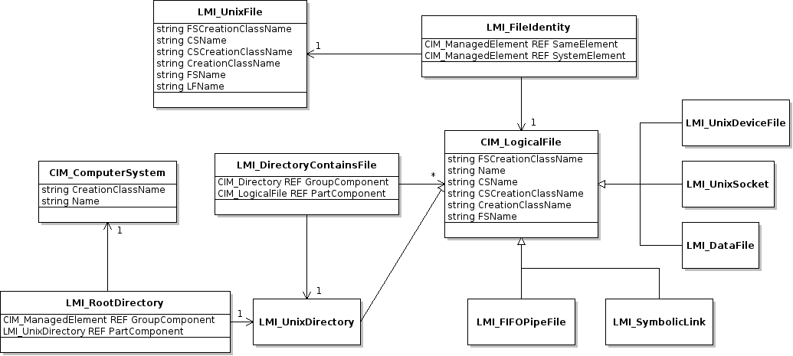

.. _tutorial:

Tutorial
========

This is a step-by-step tutorial on developing a *script* for *OpenLMI*
providers. It explains how to create simple library for instrumenting *OpenLMI
LogicalFile Provider*, wrap its functionality with *command wrapper* and
register it as a subcommand of *LMI metacommand*.

Required knowledge
------------------

You should be familiar with terms like *CIM*, *cimom*, *schema*, *provider*,
*DMTF* profile. `This short tutorial` should be enough to get you started.

You should also be familiar with scripting in *python* and
LMIShell_ which we use heavily in snippets below.

Preparation
-----------

You need ``tog-pegasus`` *cimom* up and running with ``openlmi-logicalfile``
providers installed and registered on managed machine. There is a `Quick Start
Guide`_ to assist you with setting it up. We will connect to it from a
client which needs the following installed:

* ``openlmi-python-base``
* ``openlmi-tools``

.. note::
    *RHEL* clients will also need ``openlmi-scripts`` installed because
    *LMI metacommand* is not part of *OpenLMI Tools* there.

Installing python dependencies
~~~~~~~~~~~~~~~~~~~~~~~~~~~~~~

For the first two items you may use standard rpms build for Fedora:

.. code-block:: sh

    yum install openlmi-tools

Or you may install them to your user directory as python eggs with
``pip``:

.. code-block:: sh

    pip install openlmi-tools

Dependencies are solved for you automatically in both cases.

.. note::
    On *RHEL* there are several possible scenarios:

        1. install ``openlmi-tools`` as a python egg (see above)
        2. install ``openlmi-tools`` from git (see below)
        3. install both ``openlmi-tools`` and ``openlmi-scripts`` as rpms
           with EPEL_ repository enabled (for the latter package)

    Make sure you don't mix above options.

Or directly from `git repository`_. Please follow steps described there.

Setting up environment
~~~~~~~~~~~~~~~~~~~~~~

We'll stick to the process described
`here <https://github.com/openlmi/openlmi-scripts#developing-lmi-scripts>`_
that lets us develop quickly without the need to reinstall anything while
making changes.

First let's check out our ``openlmi-scripts`` repository:

.. code-block:: sh

    git clone https://github.com/openlmi/openlmi-scripts.git
    cd openlmi-scripts

Now let's set up our workspace:

.. code-block:: sh

    WSP=~/.python_workspace
    mkdir $WSP
    # may be added to `$HOME/.profile` or `$HOME/.bashrc`
    export PYTHONPATH=$WSP:$PYTHONPATH
    export PATH="$PATH:$WSP"

.. _making_script_structure:

Making script structure
~~~~~~~~~~~~~~~~~~~~~~~

We'll use provided ``commands/make_new.py`` script to create the basic
structure and ``setup.py.skel`` file:

.. code-block:: sh

    cd commands
    # this will ask us additional questions used to create setup.py.skel file
    ./make_new.py mylf

Because a script implementation for ``OpenLMI LogicalFile`` profile is
already present in upstream repository (in ``commands/logicalfile``), we
need to name our library distinctly (e.g. ``mylf``).

Following structure should be created:

.. only:: not latex

    ::

        mylf
        ├── doc
        │   ├── _build
        │   ├── cmdline.rst
        │   ├── conf.py.skel
        │   ├── index.rst
        │   ├── Makefile
        │   ├── python.rst
        │   ├── _static
        │   └── _templates
        ├── lmi
        │   ├── __init__.py
        │   └── scripts
        │       ├── __init__.py
        │       └── mylf
        │           └── __init__.py
        ├── Makefile
        ├── README.md
        ├── setup.cfg
        └── setup.py.skel

.. raw:: latex

    \begin{center}
        \begin{tikzpicture}[dirtree]
            \node {mylf}
                child { node {doc}
                    child { node {\_build} }
                    child { node {cmdline.rst} }
                    child { node {conf.py.skel} }
                    child { node {index.rst} }
                    child { node {Makefile} }
                    child { node {python.rst} }
                    child { node {\_static} }
                    child { node {\_templates} }
                }
                child { node {lmi}
                    child { node {\_\_init\_\_.py} }
                    child { node {scripts}
                        child { node {\_\_init\_\_.py} }
                        child { node {mylf}
                            child { node {\_\_init\_\_.py} }
                        }
                    }
                }
                child { node {Makefile} }
                child { node {README.md} }
                child { node {setup.cfg} }
                child { node {setup.py.skel} };
        \end{tikzpicture} \\
    \end{center}

We should check that everything matches in ``mylf/setup.py.skel`` and correct
any shortcomings.

``setup.py`` is generated out of ``setup.py.skel`` template by running:

.. code-block:: sh

    make setup

OpenLMI LogicalFile introduction
--------------------------------

*OpenLMI LogicalFile* is a CIM provider which provides a way to read
information about files and directories. The provider also allows to
traverse the file hierarchy, create and remove empty directories.

   LogicalFile model

It consists mainly of few specializations of ``CIM_LogicalFile``
representing any type of file on filesystem, ``LMI_UnixFile`` holding
unix specific information for each such file and association classes
between them. ``CIM_LogicalFile`` has following key properties inherited
by ``LMI_*`` subclasses above:

*  **Name**
*  **CSName**
*  **CSCreationClassName**
*  ``FSCreationClassName``
*  ``CreationClassName``
*  ``FSName``

Only those shown in **bold** are mandatory. Others are ignored when
requesting an instance of ``CIM_LogicalFile``. This applies also to
``LMI_UnixFile`` with **Name** being replaced with **LFName**. None of
the presented classes supports enumeration of instances. Only references
can be obtained.

With ``CreateInstance()`` and ``DeleteInstance()`` calls issued on
class/object of ``LMI_UnixDirectory`` we are able to create and delete
directories.

Let's write some code
---------------------

Before writing code that actually does anything useful, we start by specifying
usage string. It is a command line API. Writing it will give you a clear
picture of what you're going to implement and how it will be used. Once done,
all the subcommands can be implemented one by one in a straightforward way.

Writing usage string
~~~~~~~~~~~~~~~~~~~~

Usage string is a module's documentation, help message and a
prescription for command line parser, all-in-one. Writing it is pretty
straightforward. Let's put it to ``mylf/lmi/scripts/mylf/cmd.py``:

::

    """
    Read informations about file system structure.

    Usage:
        %(cmd)s list [options] <directory>
        %(cmd)s show [-L] <file>
        %(cmd)s create <directory>
        %(cmd)s delete <directory>

    Options:
        -t --type <type>   Filter listed files by their type. One of:
                           any, file, device, directory, fifo, symlink, socket.
                           Defaults to any.
        -L --dereference   Causes symlink to be followed.
    """

The first line provides a short description that will be shown with

.. code-block:: sh

    lmi help

after the command is registered. Text under ``Usage:`` and ``Options:`` are
parsed by docopt_. It is very well readable but writing it may pose quite a
challenge for the first time developer. Please refer to its documentation for
more information.

**Note** the ``%(cmd)s`` string which needs to be present instead of
``lmi mylf`` or similar command names.

**Note** also spaces that separate options from their descriptions. There must
be a column of spaces at least 2 characters wide. Otherwise *docopt* will treat
description as a continuation of option specification.

Let's add one more snippet so we can test it:

::

    from lmi.scripts.common import command

    MyLF = command.register_subcommands('MyLF', __doc__, {})

This creates a command multiplexer without any children (we'll add them
later).

And finally let's modify our ``mylf/setup.py.skel`` by adding entry point:

::

        entry_points={
            'lmi.scripts.cmd': [
                'mylf = lmi.scripts.mylf.cmd:MyLF',
                ],
            }

Now we can install it and test it:

.. code-block:: sh

    cd mylf
    make setup      # make setup.py out of template
    # make sure the $WSP is in $PYTHONPATH
    python setup.py develop --install-dir=$WSP
    lmi help
    lmi help mylf

We should be able to see the usage string we've written.

Implementing ``show`` command
~~~~~~~~~~~~~~~~~~~~~~~~~~~~~

Now let's implement the easiest command. Let's start with appending following
snippet to `mylf/lmi/scripts/mylf/__init__.py`.

::

    import os

    from lmi.shell import LMIInstance, LMIInstanceName
    from lmi.scripts.common import errors
    from lmi.scripts.common import get_computer_system
    from lmi.scripts.common import get_logger

    LOG = get_logger(__name__)

    def logical_file_type_name(file_identity):
        """
        Get a name of file type for supplied instance of ``CIM_LogicalFile``.
        """
        namemap = {
                'lmi_datafile'       : 'file',
                'lmi_unixdevicefile' : 'device',
                'lmi_unixdirectory'  : 'directory',
                'lmi_fifopipefile'   : 'fifo',
                'lmi_symboliclink'   : 'symlink',
                'lmi_unixsocket'     : 'socket'
        }
        try:
            return namemap[file_identity.classname.lower()]
        except KeyError:
            LOG().warn('Unhandled logical file class "%s".',
                    file_identity.classname)
            return 'unknown'

    def permission_string(file_identity):
        """
        Make an ls-like permission string for supplied instance of
        ``CIM_LogicalFile``.
        """
        return ''.join(l if getattr(file_identity, a) else '-'
                  for l, a in zip('rwx', ('Readable', 'Writeable', 'Executable')))

    def get_logical_file_instance(ns, file_ident, dereference=False):
        """
        Get an instance of ``CIM_LogicalFile`` corresponding to given file
        identity.

        :param file_ident: Either a file path or an instance of ``LMI_UnixFile``.
        :param boolean dereference: Whether to follow symbolic links
        """
        if isinstance(file_ident, basestring):
            uf = get_unix_file_instance(ns, file_ident, dereference)
        elif isinstance(file_ident, LMIInstanceName):
            uf = file_ident.to_instance()
        else:
            uf = file_ident
        return uf.first_associator(AssocClass='LMI_FileIdentity')

    def get_unix_file_instance(ns, path, dereference=False):
        """
        :param boolean dereference: Whether to follow symbolic links
        :returns: Instance of ``LMI_UnixFile`` corresponding to given *path*.
        """
        cs = get_computer_system(ns)
        uf_name = ns.LMI_UnixFile.new_instance_name({
            'CSCreationClassName' : cs.classname,
            'CSName'              : cs.name,
            'LFName'              : path,
            'LFCreationClassName' : 'ignored',
            'FSCreationClassName' : 'ignored',
            'FSName'              : 'ignored',
        })
        try:
            uf = uf_name.to_instance()
            if dereference:
                lf = get_logical_file_instance(ns, uf, False)
                if logical_file_type_name(lf) == 'symlink':
                    try:
                        target = lf.TargetFile
                        if not os.path.isabs(target):
                            target = os.path.abspath(
                                    os.path.join(os.path.dirname(lf.Name), target))
                        # recursively try to dereference
                        uf = get_unix_file_instance(ns, target, dereference)
                    except Exception as err:
                        LOG.warn('failed to get link target "%s": %s',
                                lf.TargetLink, err)
            return uf
        except:
            raise errors.LmiFailed('No such file or directory: "%s".' % path)

First two functions turn their argument to a human readable form. The other two
are somewhat special. They actually interact with a broker. Each such function
takes as a first argument a :ref:`namespace object <namespaces>`, *LMIShell's*
abstraction, which acts as a liaison. All our communication is done through
this object. We always name it ``ns``. These are *getters* we will need in
our `Show` command. Getters usually return one or several instances
of :py:class:`~lmi.shell.LMIInstanceName.LMIInstanceName`.

Now let's place following into ``mylf/lmi/scripts/mylf/cmd.py``.

::

    from lmi.scripts import mylf
    from lmi.scripts.common import command
    from lmi.scripts.common import errors

    class Show(command.LmiLister):
        COLUMNS = ('Attribute', 'Value')

        def transform_options(self, options):
            options['<path>'] = options.pop('<file>')

        def execute(self, ns, path, _dereference):
            uf = mylf.get_unix_file_instance(ns, path, _dereference)
            lf = mylf.get_logical_file_instance(ns, uf, _dereference)
            return [
                ('Path'        , lf.Name),
                ('Type'        , mylf.logical_file_type_name(lf)),
                ('User ID'     , uf.UserID),
                ('Group ID'    , uf.GroupID),
                ('Size'        , lf.FileSize),
                ('Permissions' , mylf.permission_string(lf))
            ]

And change ``MyLF`` command there like this: ::

    MyLF = command.register_subcommands('MyLF', __doc__,
            { 'show' : Show })

All is set up. To try it out: ::

    $ lmi -h $HOST mylf show /root
    Attribute   Value
    Path        /root
    Type        directory
    User ID     0
    Group ID    0
    Size        4096
    Permissions r-x

Our ``Show`` command inherits from
:py:class:`~lmi.scripts.common.command.lister.LmiLister` which renderes
a table. In order to do that it needs to know number of columns and their
headings which specifies ``COLUMNS`` property.

Most of the work is done in its
:py:meth:`~lmi.scripts.common.command.endpoint.LmiEndPointCommand.execute`
method. All parameters following namespace object come from command line. First
it collects the data, make them readable and then returns them as a list of
rows.

Command line options need to be modified before passing them to object method.
:ref:`Several rules <options_transform_algorithm>` apply. We can see that
``--dereference`` option is turned to ``_dereference`` parameter name.
Replacing leading dashes with single underscore is a default behaviour that you
may customize.

Sometimes you may want to rename an option. This is a case of ``<file>``
argument that would be passed as a ``file`` which is python's *built-in*. Here
comes
:py:meth:`~lmi.scripts.common.command.endpoint.LmiEndPointCommand.transform_options`
method into play. Any possible option manipulation is allowed here. It may be
used also to convert values to your liking.

Implementing ``list``
~~~~~~~~~~~~~~~~~~~~~

Most of necessary functionality has been implemented in previous snippet for
the ``show`` command. Following snippet is enough to generate all the files in
directory. Put it again to ``mylf/lmi/scripts/mylf/__init__.py``.

::

    def make_directory_instance_name(ns, directory):
        """
        Retrieve object path of a directory.

        :type directory: string
        :param directory: Full path to the directory.
        :rtype: :py:class:`lmi.shell.LMIInstanceName.LMIInstanceName`
        """
        if directory != '/':
            directory = directory.rstrip('/')
        cs = get_computer_system(ns)
        return ns.LMI_UnixDirectory.new_instance_name(
                { 'CSCreationClassName' : cs.classname
                , 'CSName'              : cs.name
                , 'CreationClassName'   : 'LMI_UnixDirectory'
                , 'FSCreationClassName' : 'LMI_LocalFileSystem'
                , 'FSName'              : ''
                , 'Name'                : directory})

    def get_directory_instance(ns, directory):
        """
        Retrieve instance of `LMI_UnixDirectory`.

        :type directory: string of :py:class:`lmi.shell.LMIInstanceName.LMIInstanceName`
        :param directory: Full path to the directory or its instance name.
        :rtype: :py:class:`lmi.shell.LMIInstance.LMIInstance`
        """
        if isinstance(directory, basestring):
            directory = make_directory_instance_name(ns, directory)
        if isinstance(directory, LMIInstanceName):
            directory = directory.to_instance()
        return directory

    def list_directory(ns, directory, file_type='any'):
        """
        Yields instances of ``CIM_LogicalFile`` representing direct children of the
        given directory.

        :param directory: Either a file path or an instance of
            ``LMI_UnixDirectory``.
        :param file_type: Filter of files made by checking their type. One of: ::

            {'any', 'file', 'device', 'directory', 'fifo', 'symlink', 'socket'}
        """
        def _generate_children():
            for child in get_directory_instance(ns, directory).associators(
                    AssocClass='LMI_DirectoryContainsFile',
                    Role='GroupComponent',
                    ResultRole='PartComponent'):
                if (   file_type and file_type != 'any'
                   and logical_file_type_name(child) != file_type):
                    continue
                yield child
        return sorted(_generate_children(), key=lambda i: i.Name)

Note the ``associators()`` call on ``LMI_UnixDirectory`` instance. It
enumerates all ``CIM_LogicalFile`` instances that are referenced by
``LMI_DirectoryContainsFile`` associations. These represent a relation of
parent directory and its direct children. Parent directory is referenced with
``GroupComponent`` role while the children with ``PartComponent``. It's
advisable to always provide as much information to calls like:

-  ``associators()``
-  ``associator_names()``
-  ``references()``
-  ``reference_names()``

as possible. Without the ``AssocClass`` parameter given, broker would
try to enumerate all instrumented association classes possible,
resulting in very poor performance. Both ``Role`` and ``ResultRole``
parameters need to be given here, otherwise a parent directory of the
one being enumerated would also appear in output.

Following subclass of ``LmiInstanceLister`` needs to be added to
``mylf/lmi/scripts/mylf/cmd.py`` and added to ``MyLF`` subcommands
dictionary (omitted for now).

.. code-block:: python

    class List(command.LmiInstanceLister):
        CALLABLE = mylf.list_directory
        PROPERTIES = (
                'Name',
                ('Type', mylf.logical_file_type_name),
                ('Permissions', mylf.permission_string),
                ('Size', 'FileSize'))

        def verify_options(self, options):
            if options['--type'] is not None \
                   and not options['--type'].lower() in {
                       'any', 'file', 'directory', 'symlink', 'dev', 'socket',
                       'fifo'}):
                raise errors.LmiInvalidOptions(
                        'Unsupported type: %s' % options['--type'])

        def transform_options(self, options):
            file_type = options.pop('--type')
            if file_type is None:
                file_type = 'any'
            options['file-type'] = file_type

Instead of defining our own
:py:meth:`~lmi.scripts.common.command.endpoint.LmiEndPointCommand.execute`
method, we just associate ``list_directory()`` function with ``List`` command
using ``CALLABLE`` property. Thanks to the ability to transform option names in
any way, we are not limited to the use of arguments as listed in usage string.
Apart from renaming options, we also check the value of ``--type`` option.
Overriding
:py:meth:`~lmi.scripts.common.command.endpoint.LmiEndPointCommand.verify_options`
to check for validity of options is the more preferred approach compared to
delayed checking in associated function.

Implementing ``create`` and ``delete``
~~~~~~~~~~~~~~~~~~~~~~~~~~~~~~~~~~~~~~

Let's again start with content of ``mylf/lmi/scripts/mylf/__init__.py``
module.

::

    def create_directory(ns, directory):
        """
        Create a directory.

        :type directory: string
        :param directory: Full path to the directory.
        """
        ns.LMI_UnixDirectory.create_instance(
                make_directory_instance_name(ns, directory).path.keybindings)

    def delete_directory(ns, directory):
        """
        Delete an empty directory.

        :param directory: Either a file path or an instance of
            ``LMI_UnixDirectory``.
        """
        get_directory_instance(ns, directory).delete()

``create_instance()`` call of any ``LMIClass`` creates a new instance, in this
case we create an instance of ``LMI_UnixDirectory``. If it exists already, an
exception will be raised. On the other hand, ``delete_directory()`` operates on
an :py:class:`~lmi.shell.LMIInstance.LMIInstance` which must exists. If
directory does not exist or it's not empty, an exception will be raised.

Now let's move on to ``mylf/lmi/scripts/mylf/cmd.py``:

::

    class Create(command.LmiCheckResult):
        EXPECT = None
        CALLABLE = mylf.create_directory

    class Delete(command.LmiCheckResult):
        EXPECT = None
        CALLABLE = mylf.delete_directory

:py:class:`~lmi.script.common.command.checkresult.LmiCheckResult` is a special
command that prints no useful information. It allows us to check, whether the
associated function returns expected result and prints an error if not. Here we
expect ``None``. Associated functions in this case throw an exception upon any
error which have the same effect.

Test it
~~~~~~~

.. code-block:: sh

    lmi -h $HOST mylf create /root/some_directory
    # try it for the second time (it will fail)
    lmi -h $HOST mylf create /root/some_directory
    # now let's delete it
    lmi -h $HOST mylf delete /root/some_directory
    # try it for the second time (it will fail)
    lmi -h $HOST mylf delete /root/some_directory

Summary
-------

Now that the script is ready and tested, we may commit it, push it, do a
`pull request` and host it on PyPI_:

.. code-block:: sh

    python setup.py register
    python setup.py sdist upload

Source code of this example is available as a
:download:`tarball <../../_static/mylf.tar.gz>`.

.. _LMIShell: http://www.openlmi.org/using_lmishell
.. _This short tutorial: http://fedorahosted.org/openlmi/wiki/ProviderTutorialIntroduction
.. _docopt: http://docopt.org
.. _pull request: https://help.github.com/articles/using-pull-requests
.. _PyPI: https://pypi.python.org/pypi
.. _EPEL: https://fedoraproject.org/wiki/EPEL
.. _git repository: https://github.com/openlmi/openlmi-scripts
.. _Quick Start Guide: http://www.openlmi.org/QuickStart
